# 线性方程组

Ax=b

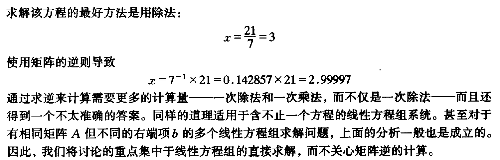

## 反斜线符号算符

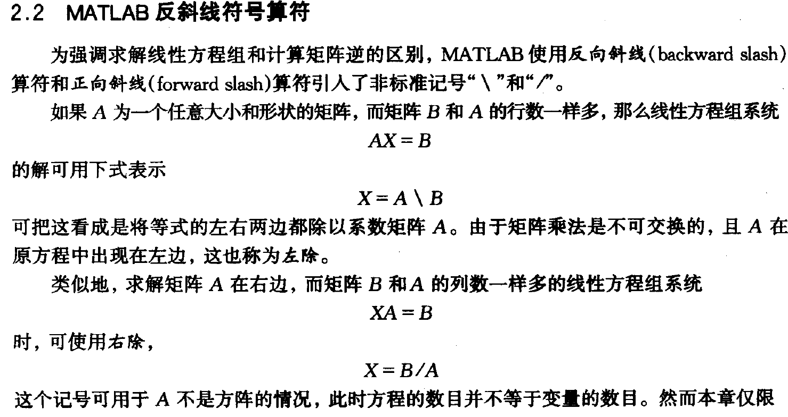

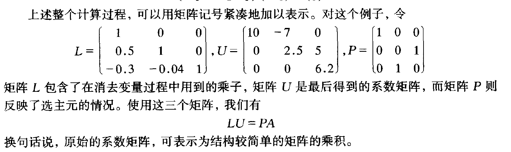

### LU

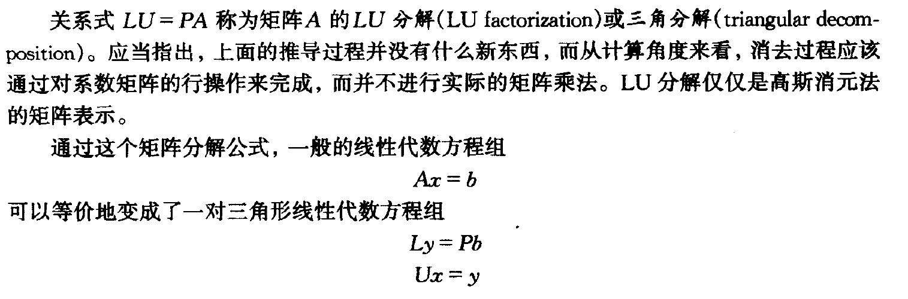

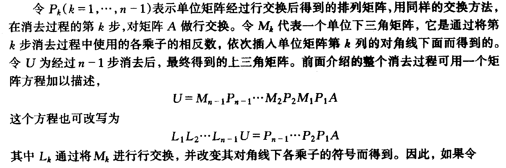

### 主元

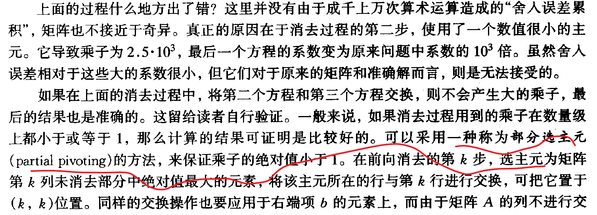

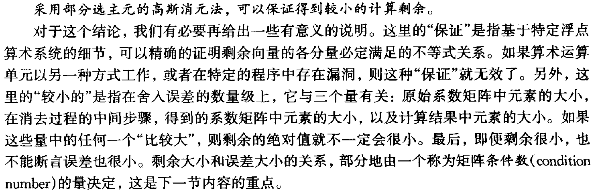

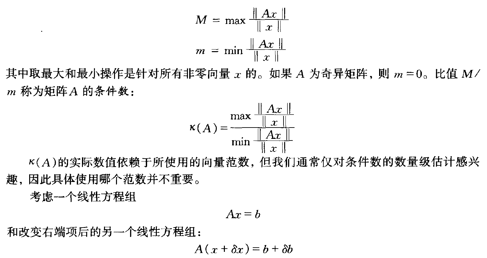

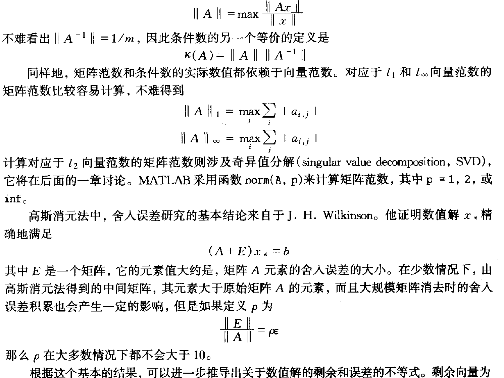

## 2.8 舍入误差的影响

采用部分主元的高斯消去法，可以保证得到较小的计算剩余

## 2.9番薯和条件书

**nealy singular**

如果矩阵接近奇异，A和b上小的改变，导致x上很大的变换。

**范数**

* norm(x,1)
* norm(x,2)
* norm(x,inf)

敏感性测量，可能变换范围

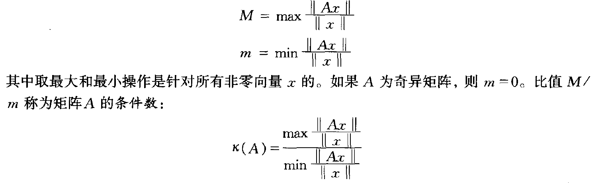

在此基础上，A进行奇异值分解

矩阵范数

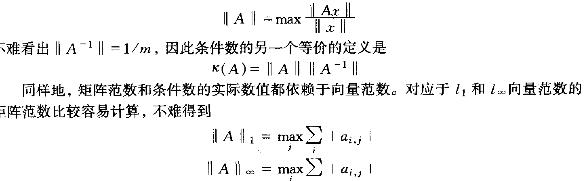

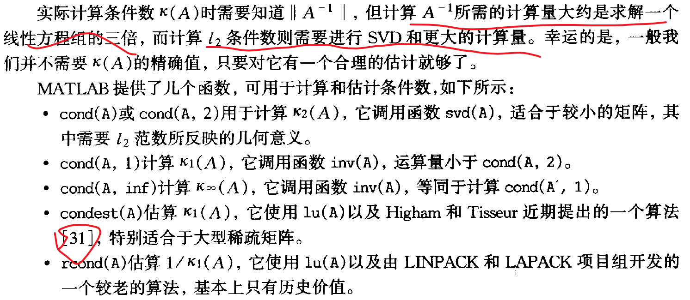

* A的逆计算量大
* l2条件书需要进行SVD和更大的计算量。
* 合理估计

## 2.10 稀疏矩阵和带状矩阵

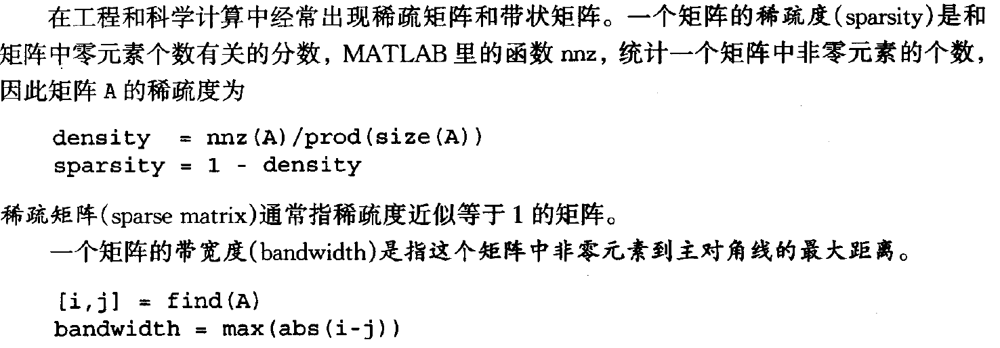

S=sparse(A)  将矩阵转换为稀疏矩阵表示

A=full(S)  相反操作

* 三角矩阵

  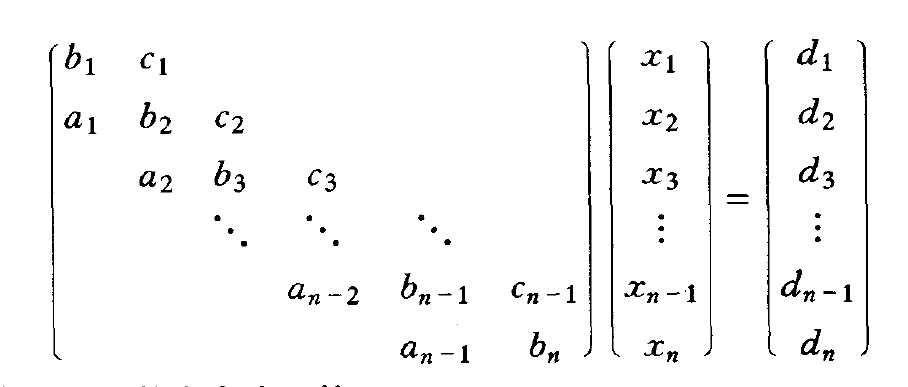

  tridisolve(a,b,c,d)::: 基本都满足主对角元素占优的性质，没有必要选择主元

# 插值

## 3.1 差值多项式

* 拉格朗日

  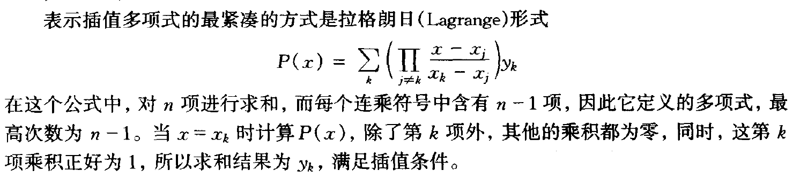

* 幂形式

  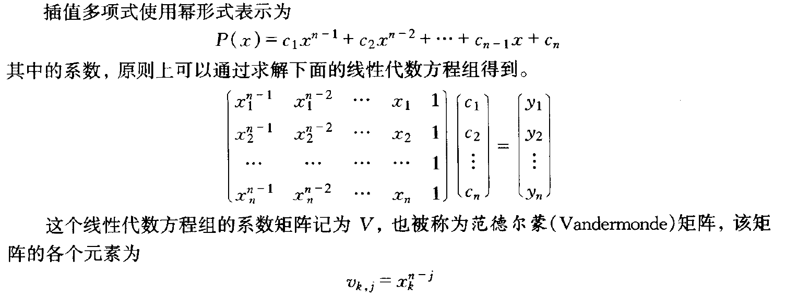

## 3.2 分段线性插值

