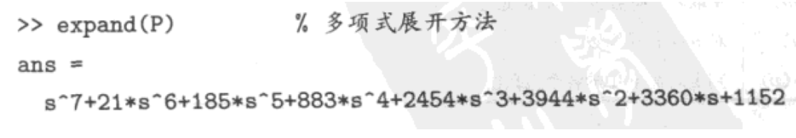
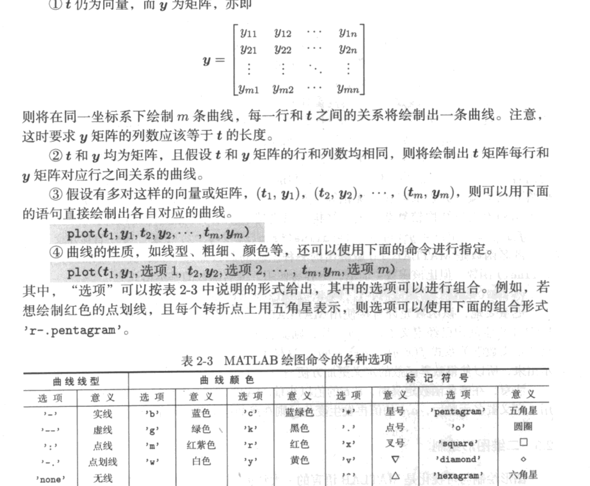
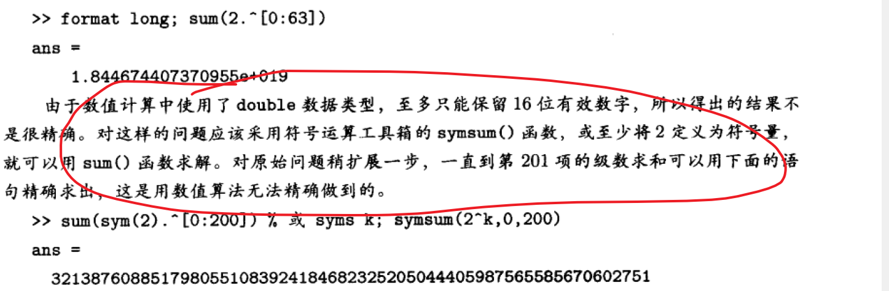

# 第一章

## 数据结构

双精度

IEEE

double（）

图像处理：uint8()

* 符号型：

syms varList varProps
syms a real

以任意指定精度显示出
vpa()
vpa(A)
vpa(A,n) n represents the digits to show

* 字符串数据---单引号

* 多维数组---

* 单元数组---矩阵的直接扩展。矩阵的每个元素不是数值，可以认为存储任意类型的信息

* 类和对象---包含各种下级的信息，重新对类定义其计算。

## MATLAB 基本预计结构
* 直接赋值语句
* 函数调用语句

## 冒号表达式与子矩阵提取

v=s1:s2:s3
s1:向量起始值
s2:步距
s3:向量终点值

## 矩阵代数运算

* 矩阵转置   A'===Hermit转置   A.'===转置
* 加减法运算
* 矩阵乘法
* 左除： AX=B   X=A\B
* 右除：  XA=B  X=B/A
* 翻转： 左右翻转：  fliplr（A)    上下翻转：   flipud(A)  矩阵逆时针旋转90度 ：  rot90(A)
* 乘方运算
* 点运算：  对应元素的直接运算

## 矩阵的逻辑运算
* 矩阵的与运算  A&B
* 矩阵的或运算 A|B
* 矩阵的非运算 ~A
* 矩阵的异或运算 xor(A,B)

## 矩阵的比较运算
* A>B  A~=B
* [i,j]=find(A>=6)
* all(A>=5): 当矩阵某列元素全部大于或等于5，相应元素为1 ，否则0
* any(A>=5):  当矩阵某列元素中含有大于或等于5，相应元素俄日1，否则0
* 如果判断一个矩阵是否元素均大于或等于5，则all(A(:)>=5)

## 解析结果的化简与变换

* simple

* expand

* subs

* latex

$$
\cos\!\left(b\right) - t^4\, \left( - \frac{\cos\!\left(b\right)\, a^4}{24} + \frac{c^3\, d}{6} + \frac{c\, d^3}{6}\right) + t^2\, \left(c\, d - \frac{a^2\, \cos\!\left(b\right)}{2}\right) - a\, t\, \sin\!\left(b\right) + \frac{a^3\, t^3\, \sin\!\left(b\right)}{6} - \frac{a^5\, t^5\, \sin\!\left(b\right)}{120}
$$

## 基本数论运算

% floor ceil round fix rat rem gcd lcm factor isprime
A=[-0.6546,0.645,0.6547,4.756,0.505,0.20,9.1];
disp(A);
disp('floor(A)')% 向下取整
disp(floor(A))
disp('ceil(A)')% 向上取整
disp(ceil(A))
disp('round(A)')% 向0取整
disp(round(A))
disp('fix(A)')%最近的整数
disp(fix(A))

HB=hild(3);
% 元素变化成最简有理数，n和d分别为分子和分母矩阵
[n,d]=rat(HB);
disp(HB)
disp('rat(HB)')
disp(n)
disp(d)

%gcd lcm
m=sym(1856120);
n=sym(1483720);
disp('gcd and lcm')
disp(m)
disp(n)
disp([gcd(m,n),lcm(m,n)])
disp(factor(lcm(m,n)))

% all prime between 1 and 1000
A=1:1000;
disp('all prime between 1 and 1000')
disp(A(isprime(A)))

## 循环结构

* for

  

* while

## 转移结构

## 开关结构

## 试探结构

## 函数编写与调试

## inline函数与匿名函数

##  二维图像绘制
plot(x,y)

* set and get

* other

  
% polor
theta=1:0.01:6*pi;
rho=5*sin(4*theta/3);
polar(theta,rho);
figure;
rho=5*sin(theta/3);
polar(theta,rho);

%bar stairs stem bar semilogx
t=0:0.02:2*pi;
y=sin(t);
subplot(2,2,1)
stairs(t,y);
subplot(2,2,2)
stem(t,y);
subplot(2,2,3)
bar(t,y)
subplot(2,2,4)
semilogx(t,y)

%%
% 隐函数绘图
subplot(2,1,1)
ezplot('x^2*sin(x+y^2)+y^2*exp(x+y)+5*cos(x^2+y)');
subplot(2,1,2)
ezplot('x^2*sin(x+y^2)+y^2*exp(x+y)+5*cos(x^2+y)',[-10,10]);

## 三位曲线和曲面绘制

%plot3
t=0:0.01:3*pi;
x=t.^3.*sin(3*t).*exp(-t);
y=t.^3.*cos(3*t).*exp(-t);
z=t.^2;
plot3(x,y,z);
grid;

stem3(x,y,z);

% 三维曲面 meshgrid

% Butterworth

[x,y]=meshgrid(0:31);
n=2;
D0=200;
D=sqrt((x-16).^2+(y-16).^2);
z=1./(1+D.^(2*n)/D0);
mesh(x,y,z);
axis([0,31,0,31,0,1])

surf(x,y,z)

## 总结

Simplify representations of uncertain objects

表达式为
B = simplify(A)
B = simplify(A,'full')
B = simplify(A,'basic')
B = simplify(A,'off')

# 微积分问题的计算机求解

## 解析解
* 单变量极限
Limit(func,x,x0)

$$
x\, \sin\!\left(\frac{b}{x}\right)\, {\left(\frac{a}{x} + 1\right)}^x
$$

$$
-\frac{\mathrm{e}^{x^3} - 1}{\cos\!\left(\sqrt{x - \sin\!\left(x\right)}\right) - 1}
$$

* 多变量极限

$$
\frac{\mathrm{e}^{-\frac{1}{x^2 + y^2}}\, {\sin\!\left(x\right)}^2\, {\left(\frac{1}{y^2} + 1\right)}^{10\, y^2 + x}}{x^2}
$$

## 函数导数

* func
sin(x)/(x^2 + 4*x + 3)

$$
\frac{\sin\!\left(x\right)}{x^2 + 4\, x + 3}
$$
* df
cos(x)/(x^2 + 4*x + 3) - (sin(x)*(2*x + 4))/(x^2 + 4*x + 3)^2

$$
\frac{\cos\!\left(x\right)}{x^2 + 4\, x + 3} - \frac{\sin\!\left(x\right)\, \left(2\, x + 4\right)}{{\left(x^2 + 4\, x + 3\right)}^2}
$$
* d2f
(2*sin(x)*(2*x + 4)^2)/(x^2 + 4*x + 3)^3 - (2*sin(x))/(x^2 + 4*x + 3)^2 - sin(x)/(x^2 + 4*x + 3) - (2*cos(x)*(2*x + 4))/(x^2 + 4*x + 3)^2

$$
\frac{2\, \sin\!\left(x\right)\, {\left(2\, x + 4\right)}^2}{{\left(x^2 + 4\, x + 3\right)}^3} - \frac{2\, \sin\!\left(x\right)}{{\left(x^2 + 4\, x + 3\right)}^2} - \frac{\sin\!\left(x\right)}{x^2 + 4\, x + 3} - \frac{2\, \cos\!\left(x\right)\, \left(2\, x + 4\right)}{{\left(x^2 + 4\, x + 3\right)}^2}
$$
* d3f
(6*cos(x)*(2*x + 4)^2)/(x^2 + 4*x + 3)^3 - (6*cos(x))/(x^2 + 4*x + 3)^2 - cos(x)/(x^2 + 4*x + 3) - (6*sin(x)*(2*x + 4)^3)/(x^2 + 4*x + 3)^4 + (3*sin(x)*(2*x + 4))/(x^2 + 4*x + 3)^2 + (4*sin(x)*(2*x + 4))/(x^2 + 4*x + 3)^3 + (2*sin(x)*(8*x + 16))/(x^2 + 4*x + 3)^3

$$
\frac{6\, \cos\!\left(x\right)\, {\left(2\, x + 4\right)}^2}{{\left(x^2 + 4\, x + 3\right)}^3} - \frac{6\, \cos\!\left(x\right)}{{\left(x^2 + 4\, x + 3\right)}^2} - \frac{\cos\!\left(x\right)}{x^2 + 4\, x + 3} - \frac{6\, \sin\!\left(x\right)\, {\left(2\, x + 4\right)}^3}{{\left(x^2 + 4\, x + 3\right)}^4} + \frac{3\, \sin\!\left(x\right)\, \left(2\, x + 4\right)}{{\left(x^2 + 4\, x + 3\right)}^2} + \frac{4\, \sin\!\left(x\right)\, \left(2\, x + 4\right)}{{\left(x^2 + 4\, x + 3\right)}^3} + \frac{2\, \sin\!\left(x\right)\, \left(8\, x + 16\right)}{{\left(x^2 + 4\, x + 3\right)}^3}
$$
* d4f
sin(x)/(x^2 + 4*x + 3) + (12*sin(x))/(x^2 + 4*x + 3)^2 + (24*sin(x))/(x^2 + 4*x + 3)^3 - (24*cos(x)*(2*x + 4)^3)/(x^2 + 4*x + 3)^4 - (12*sin(x)*(2*x + 4)^2)/(x^2 + 4*x + 3)^3 - (48*sin(x)*(2*x + 4)^2)/(x^2 + 4*x + 3)^4 + (24*sin(x)*(2*x + 4)^4)/(x^2 + 4*x + 3)^5 + (4*cos(x)*(2*x + 4))/(x^2 + 4*x + 3)^2 + (16*cos(x)*(2*x + 4))/(x^2 + 4*x + 3)^3 + (8*cos(x)*(8*x + 16))/(x^2 + 4*x + 3)^3 - (6*sin(x)*(2*x + 4)*(8*x + 16))/(x^2 + 4*x + 3)^4

$$
\frac{\sin\!\left(x\right)}{x^2 + 4\, x + 3} + \frac{12\, \sin\!\left(x\right)}{{\left(x^2 + 4\, x + 3\right)}^2} + \frac{24\, \sin\!\left(x\right)}{{\left(x^2 + 4\, x + 3\right)}^3} - \frac{24\, \cos\!\left(x\right)\, {\left(2\, x + 4\right)}^3}{{\left(x^2 + 4\, x + 3\right)}^4} - \frac{12\, \sin\!\left(x\right)\, {\left(2\, x + 4\right)}^2}{{\left(x^2 + 4\, x + 3\right)}^3} - \frac{48\, \sin\!\left(x\right)\, {\left(2\, x + 4\right)}^2}{{\left(x^2 + 4\, x + 3\right)}^4} + \frac{24\, \sin\!\left(x\right)\, {\left(2\, x + 4\right)}^4}{{\left(x^2 + 4\, x + 3\right)}^5} + \frac{4\, \cos\!\left(x\right)\, \left(2\, x + 4\right)}{{\left(x^2 + 4\, x + 3\right)}^2} + \frac{16\, \cos\!\left(x\right)\, \left(2\, x + 4\right)}{{\left(x^2 + 4\, x + 3\right)}^3} + \frac{8\, \cos\!\left(x\right)\, \left(8\, x + 16\right)}{{\left(x^2 + 4\, x + 3\right)}^3} - \frac{6\, \sin\!\left(x\right)\, \left(2\, x + 4\right)\, \left(8\, x + 16\right)}{{\left(x^2 + 4\, x + 3\right)}^4}
$$

-4*z*exp(- y*x^2 - z^2)*(cos(x^2*y) - sin(x^2*y) + 4*x^4*y^2*cos(x^2*y) + 4*x^4*y^2*sin(x^2*y) - 10*x^2*y*cos(x^2*y))

$$
- 4\, z\, \mathrm{e}^{ - 1\, y\, x^2 - z^2}\, \left(\cos\!\left(x^2\, y\right) - \sin\!\left(x^2\, y\right) + 4\, x^4\, y^2\, \cos\!\left(x^2\, y\right) + 4\, x^4\, y^2\, \sin\!\left(x^2\, y\right) - 10\, x^2\, y\, \cos\!\left(x^2\, y\right)\right)
$$

x
$$
r\, \cos\!\left(\mathrm{phi}\right)\, \sin\!\left(\mathrm{theta}\right)
$$
y
$$
r\, \sin\!\left(\mathrm{phi}\right)\, \sin\!\left(\mathrm{theta}\right)
$$
z

[ cos(phi)*sin(theta), r*cos(phi)*cos(theta), -r*sin(phi)*sin(theta)]
[ sin(phi)*sin(theta), r*cos(theta)*sin(phi),  r*cos(phi)*sin(theta)]
[          cos(theta),         -r*sin(theta),                      0]
$$
r\, \cos\!\left(\mathrm{theta}\right)
$$
$$
\cos\!\left(\mathrm{phi}\right)\, \sin\!\left(\mathrm{theta}\right)
$$
$$
r\, \cos\!\left(\mathrm{phi}\right)\, \cos\!\left(\mathrm{theta}\right)
$$
$$
- r\, \sin\!\left(\mathrm{phi}\right)\, \sin\!\left(\mathrm{theta}\right)
$$
$$
\sin\!\left(\mathrm{phi}\right)\, \sin\!\left(\mathrm{theta}\right)
$$
$$
r\, \cos\!\left(\mathrm{theta}\right)\, \sin\!\left(\mathrm{phi}\right)
$$
$$
r\, \cos\!\left(\mathrm{phi}\right)\, \sin\!\left(\mathrm{theta}\right)
$$
$$
\cos\!\left(\mathrm{theta}\right)
$$
$$
- r\, \sin\!\left(\mathrm{theta}\right)
$$
$$
0
$$

## 隐函数
* dy/dx
(exp(x^2 + x*y + y^2)*(exp(- x^2 - x*y - y^2)*(2*x - 2) + exp(- x^2 - x*y - y^2)*(- x^2 + 2*x)*(2*x + y)))/((- x^2 + 2*x)*(x + 2*y))

$$
-\frac{2\, x + 2\, x\, y - x^2\, y + 4\, x^2 - 2\, x^3 - 2}{x\, \left(x + 2\, y\right)\, \left(x - 2\right)}
$$

## 参数方程

* dy4dx

  

$$
\frac{\frac{12\, \cos\!\left(t\right)}{{\left(t + 1\right)}^4} - \frac{240\, \cos\!\left(t\right)}{{\left(t + 1\right)}^6} + \frac{\sin\!\left(t\right)}{{\left(t + 1\right)}^3} - \frac{72\, \sin\!\left(t\right)}{{\left(t + 1\right)}^5} + \frac{360\, \sin\!\left(t\right)}{{\left(t + 1\right)}^7}}{\frac{\cos\!\left(t\right)}{{\left(t + 1\right)}^3} - \frac{72\, \cos\!\left(t\right)}{{\left(t + 1\right)}^5} + \frac{360\, \cos\!\left(t\right)}{{\left(t + 1\right)}^7} - \frac{12\, \sin\!\left(t\right)}{{\left(t + 1\right)}^4} + \frac{240\, \sin\!\left(t\right)}{{\left(t + 1\right)}^6}}
$$

## 积分问题

* y
sin(x)/(x^2 + 4*x + 3)

$$
\frac{\sin\!\left(x\right)}{x^2 + 4\, x + 3}
$$
* dy/dx
cos(x)/(x^2 + 4*x + 3) - (sin(x)*(2*x + 4))/(x^2 + 4*x + 3)^2

\frac{\cos\!\left(x\right)}{x^2 + 4\, x + 3} - \frac{\sin\!\left(x\right)\, \left(2\, x + 4\right)}{{\left(x^2 + 4\, x + 3\right)}^2}
* int(dy)
sin(x)/(x^2 + 4*x + 3)

$$
\frac{\sin\!\left(x\right)}{x^2 + 4\, x + 3}
$$

* f1
exp(- y*x^2 - z^2)*(2*cos(x^2*y) - 2*sin(x^2*y) + 8*x^4*y^2*sin(x^2*y) - 20*x^2*y*cos(x^2*y) + 8*x^4*y*cos(x^2*y))

$$
\mathrm{e}^{ - 1\, y\, x^2 - z^2}\, \left(2\, \cos\!\left(x^2\, y\right) - 2\, \sin\!\left(x^2\, y\right) + 8\, x^4\, y^2\, \sin\!\left(x^2\, y\right) - 20\, x^2\, y\, \cos\!\left(x^2\, y\right) + 8\, x^4\, y\, \cos\!\left(x^2\, y\right)\right)
$$
* f2
4*x^2*z*exp(- y*x^2 - z^2)*(2*y^2*cos(x^2*y) + 2*y^2*sin(x^2*y) + 2*y*cos(x^2*y) - 2*y*sin(x^2*y)) - 4*z*exp(- y*x^2 - z^2)*(2*sin(x^2*y) + y*cos(x^2*y) - 5*y*sin(x^2*y)) + (4*z*exp(- y*x^2 - z^2)*(2*cos(x^2*y) + 2*sin(x^2*y)))/x^2

$$
4\, x^2\, z\, \mathrm{e}^{ - 1\, y\, x^2 - z^2}\, \left(2\, y^2\, \cos\!\left(x^2\, y\right) + 2\, y^2\, \sin\!\left(x^2\, y\right) + 2\, y\, \cos\!\left(x^2\, y\right) - 2\, y\, \sin\!\left(x^2\, y\right)\right) - 4\, z\, \mathrm{e}^{ - 1\, y\, x^2 - z^2}\, \left(2\, \sin\!\left(x^2\, y\right) + y\, \cos\!\left(x^2\, y\right) - 5\, y\, \sin\!\left(x^2\, y\right)\right) + \frac{4\, z\, \mathrm{e}^{ - 1\, y\, x^2 - z^2}\, \left(2\, \cos\!\left(x^2\, y\right) + 2\, \sin\!\left(x^2\, y\right)\right)}{x^2}
$$
* f3
int(-4*z*exp(- y*x^2 - z^2)*(cos(x^2*y) - sin(x^2*y) + 4*x^4*y^2*sin(x^2*y) - 10*x^2*y*cos(x^2*y) + 4*x^4*y*cos(x^2*y)), x)

$$
\int - 4\, z\, \mathrm{e}^{ - 1\, y\, x^2 - z^2}\, \left(\cos\!\left(x^2\, y\right) - \sin\!\left(x^2\, y\right) + 4\, x^4\, y^2\, \sin\!\left(x^2\, y\right) - 10\, x^2\, y\, \cos\!\left(x^2\, y\right) + 4\, x^4\, y\, \cos\!\left(x^2\, y\right)\right) \,d x
$$

## Taylor

* Taylor function
sin(9)/120 + (x - 9)*(cos(9)/120 - (11*sin(9))/7200) - (x - 9)^2*((11*cos(9))/7200 + (1709*sin(9))/432000) - (x - 9)^3*((509*cos(9))/432000 - (19129*sin(9))/25920000) + ((58051*cos(9))/1555200000 - (4763231*sin(9))/93312000000)*(x - 9)^5 + ((5929*cos(9))/25920000 + (380851*sin(9))/1555200000)*(x - 9)^4

$$
\frac{\sin\!\left(9\right)}{120} + \left(x - 9\right)\, \left(\frac{\cos\!\left(9\right)}{120} - \frac{11\, \sin\!\left(9\right)}{7200}\right) - {\left(x - 9\right)}^2\, \left(\frac{11\, \cos\!\left(9\right)}{7200} + \frac{1709\, \sin\!\left(9\right)}{432000}\right) - {\left(x - 9\right)}^3\, \left(\frac{509\, \cos\!\left(9\right)}{432000} - \frac{19129\, \sin\!\left(9\right)}{25920000}\right) + \left(\frac{58051\, \cos\!\left(9\right)}{1555200000} - \frac{4763231\, \sin\!\left(9\right)}{93312000000}\right)\, {\left(x - 9\right)}^5 + \left(\frac{5929\, \cos\!\left(9\right)}{25920000} + \frac{380851\, \sin\!\left(9\right)}{1555200000}\right)\, {\left(x - 9\right)}^4
$$

* taylor 
     8

\sin\!\left(8\right) - \frac{\sin\!\left(8\right)\, {\left(x - 8\right)}^2}{2} + \frac{\sin\!\left(8\right)\, {\left(x - 8\right)}^4}{24} + \cos\!\left(8\right)\, \left(x - 8\right) - \frac{\cos\!\left(8\right)\, {\left(x - 8\right)}^3}{6} + \frac{\cos\!\left(8\right)\, {\left(x - 8\right)}^5}{120}
$$
\sin\!\left(8\right) - \frac{\sin\!\left(8\right)\, {\left(x - 8\right)}^2}{2} + \frac{\sin\!\left(8\right)\, {\left(x - 8\right)}^4}{24} + \cos\!\left(8\right)\, \left(x - 8\right) - \frac{\cos\!\left(8\right)\, {\left(x - 8\right)}^3}{6} + \frac{\cos\!\left(8\right)\, {\left(x - 8\right)}^5}{120}
$$
* taylor 
    10

\sin\!\left(10\right) - \frac{\sin\!\left(10\right)\, {\left(x - 10\right)}^2}{2} + \frac{\sin\!\left(10\right)\, {\left(x - 10\right)}^4}{24} + \cos\!\left(10\right)\, \left(x - 10\right) - \frac{\cos\!\left(10\right)\, {\left(x - 10\right)}^3}{6} + \frac{\cos\!\left(10\right)\, {\left(x - 10\right)}^5}{120}
$$
\sin\!\left(10\right) - \frac{\sin\!\left(10\right)\, {\left(x - 10\right)}^2}{2} + \frac{\sin\!\left(10\right)\, {\left(x - 10\right)}^4}{24} + \cos\!\left(10\right)\, \left(x - 10\right) - \frac{\cos\!\left(10\right)\, {\left(x - 10\right)}^3}{6} + \frac{\cos\!\left(10\right)\, {\left(x - 10\right)}^5}{120}
$$
* taylor 
    12

\sin\!\left(12\right) - \frac{\sin\!\left(12\right)\, {\left(x - 12\right)}^2}{2} + \frac{\sin\!\left(12\right)\, {\left(x - 12\right)}^4}{24} + \cos\!\left(12\right)\, \left(x - 12\right) - \frac{\cos\!\left(12\right)\, {\left(x - 12\right)}^3}{6} + \frac{\cos\!\left(12\right)\, {\left(x - 12\right)}^5}{120}
$$
\sin\!\left(12\right) - \frac{\sin\!\left(12\right)\, {\left(x - 12\right)}^2}{2} + \frac{\sin\!\left(12\right)\, {\left(x - 12\right)}^4}{24} + \cos\!\left(12\right)\, \left(x - 12\right) - \frac{\cos\!\left(12\right)\, {\left(x - 12\right)}^3}{6} + \frac{\cos\!\left(12\right)\, {\left(x - 12\right)}^5}{120}
$$
* taylor 
    14

\sin\!\left(14\right) - \frac{\sin\!\left(14\right)\, {\left(x - 14\right)}^2}{2} + \frac{\sin\!\left(14\right)\, {\left(x - 14\right)}^4}{24} + \cos\!\left(14\right)\, \left(x - 14\right) - \frac{\cos\!\left(14\right)\, {\left(x - 14\right)}^3}{6} + \frac{\cos\!\left(14\right)\, {\left(x - 14\right)}^5}{120}
$$
\sin\!\left(14\right) - \frac{\sin\!\left(14\right)\, {\left(x - 14\right)}^2}{2} + \frac{\sin\!\left(14\right)\, {\left(x - 14\right)}^4}{24} + \cos\!\left(14\right)\, \left(x - 14\right) - \frac{\cos\!\left(14\right)\, {\left(x - 14\right)}^3}{6} + \frac{\cos\!\left(14\right)\, {\left(x - 14\right)}^5}{120}
$$
* taylor 
    16

\sin\!\left(16\right) - \frac{\sin\!\left(16\right)\, {\left(x - 16\right)}^2}{2} + \frac{\sin\!\left(16\right)\, {\left(x - 16\right)}^4}{24} + \cos\!\left(16\right)\, \left(x - 16\right) - \frac{\cos\!\left(16\right)\, {\left(x - 16\right)}^3}{6} + \frac{\cos\!\left(16\right)\, {\left(x - 16\right)}^5}{120}
$$
\sin\!\left(16\right) - \frac{\sin\!\left(16\right)\, {\left(x - 16\right)}^2}{2} + \frac{\sin\!\left(16\right)\, {\left(x - 16\right)}^4}{24} + \cos\!\left(16\right)\, \left(x - 16\right) - \frac{\cos\!\left(16\right)\, {\left(x - 16\right)}^3}{6} + \frac{\cos\!\left(16\right)\, {\left(x - 16\right)}^5}{120}
$$

* taylor 
x^5/120 - x^3/6 + x

$$
\frac{x^5}{120} - \frac{x^3}{6} + x
$$

## 多变量函数Taylor幂级数展开

* 多变量函数Taylor幂级数展开

$$
\left(\frac{831214181\, \mathrm{e}^{-244}\, \left(y - 8\right)}{3} - 10731691\, \mathrm{e}^{-244} - 3565954708\, \mathrm{e}^{-244}\, {\left(y - 8\right)}^2 + \frac{183020033765\, \mathrm{e}^{-244}\, {\left(y - 8\right)}^3}{6} - \frac{7023429503075\, \mathrm{e}^{-244}\, {\left(y - 8\right)}^4}{36} + \frac{29854611922859\, \mathrm{e}^{-244}\, {\left(y - 8\right)}^5}{30}\right)\, x^5 + \left(\frac{1615611367\, \mathrm{e}^{-244}}{3} - \frac{41712159362\, \mathrm{e}^{-244}\, \left(y - 8\right)}{3} + \frac{1073690388829\, \mathrm{e}^{-244}\, {\left(y - 8\right)}^2}{6} - \frac{13776667161391\, \mathrm{e}^{-244}\, {\left(y - 8\right)}^3}{9} + \frac{176228365145683\, \mathrm{e}^{-244}\, {\left(y - 8\right)}^4}{18} - \frac{2247302812596229\, \mathrm{e}^{-244}\, {\left(y - 8\right)}^5}{45}\right)\, x^4 + \left(\frac{837294209729\, \mathrm{e}^{-244}\, \left(y - 8\right)}{3} - \frac{32430232010\, \mathrm{e}^{-244}}{3} - 3592075938839\, \mathrm{e}^{-244}\, {\left(y - 8\right)}^2 + \frac{276543949095653\, \mathrm{e}^{-244}\, {\left(y - 8\right)}^3}{9} - \frac{1768756837899578\, \mathrm{e}^{-244}\, {\left(y - 8\right)}^4}{9} + \frac{6014852606653373\, \mathrm{e}^{-244}\, {\left(y - 8\right)}^5}{6}\right)\, x^3 + \left(108496987477\, \mathrm{e}^{-244} - \frac{8403674878610\, \mathrm{e}^{-244}\, \left(y - 8\right)}{3} + 36052796676387\, \mathrm{e}^{-244}\, {\left(y - 8\right)}^2 - \frac{925206493327678\, \mathrm{e}^{-244}\, {\left(y - 8\right)}^3}{3} + \frac{35505548947353289\, \mathrm{e}^{-244}\, {\left(y - 8\right)}^4}{18} - \frac{150926486335216409\, \mathrm{e}^{-244}\, {\left(y - 8\right)}^5}{15}\right)\, x^2 + \left(\frac{42173163224576\, \mathrm{e}^{-244}\, \left(y - 8\right)}{3} - \frac{1633441470286\, \mathrm{e}^{-244}}{3} - \frac{542787029326322\, \mathrm{e}^{-244}\, {\left(y - 8\right)}^2}{3} + \frac{13929371041972000\, \mathrm{e}^{-244}\, {\left(y - 8\right)}^3}{9} - \frac{89092299978523517\, \mathrm{e}^{-244}\, {\left(y - 8\right)}^4}{9} + \frac{2272286180854607272\, \mathrm{e}^{-244}\, {\left(y - 8\right)}^5}{45}\right)\, x + \left(\frac{3278944100000\, \mathrm{e}^{-244}}{3} - \frac{84658178600000\, \mathrm{e}^{-244}\, \left(y - 8\right)}{3} + 363197858400000\, \mathrm{e}^{-244}\, {\left(y - 8\right)}^2 - \frac{27962044970000000\, \mathrm{e}^{-244}\, {\left(y - 8\right)}^3}{9} + \frac{178846302179075000\, \mathrm{e}^{-244}\, {\left(y - 8\right)}^4}{9} - \frac{304098274712930000\, \mathrm{e}^{-244}\, {\left(y - 8\right)}^5}{3}\right)
$$

## 傅里叶级数展开

symsum

