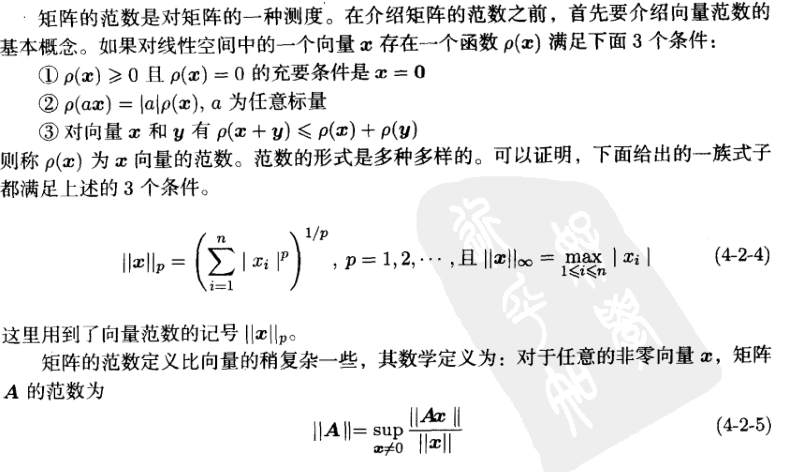
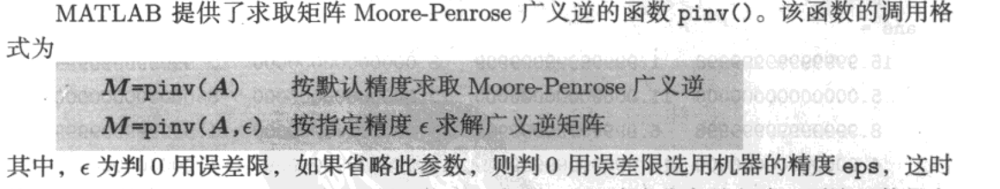
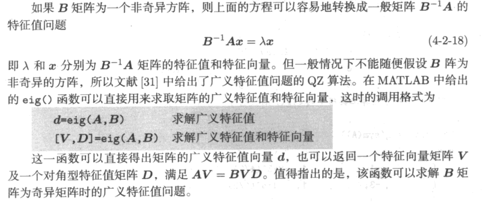

# 线性代数问题的计算机求解

## 特殊矩阵

* 单位  零

* 随机矩阵

  

* 对角元素

注意 第k条对角线。中间向上第k条

* Hankel

* Hilbert

  

* Vandermonde

  

* 伴随矩阵

  

  

* sym(A)

## 矩阵基本分析

### 基本概念

* det

  

  tic
  A=sym(hilb(10));
  disp(det(A))
  toc

* trace

* rank

  

  

* norm

  

  

  

* poly 特征多项式

  

  

  

* **Fadeev-Fadeeva**

  

* 矩阵多项式求解

  

  

  

* poly2sym 符号多项式与数值多项式的转换（记得subs)

  

* inv

  

  

* 广义逆

  

  

## 特征值

* eig

  

  

* 广义特征值和特征向量

  

### 基本变化

* 相似变换

  

  

* LU 

  

  

* cholesky

  

  

* 正定与正则矩阵

  

* 特征根 Jordan

  

  

* 奇异值

  

  

​	

* 方程组

  

  

  

* lyapunov

  

  

* Sylvester

  

  

* Riccati

  

## 非线性运算与矩阵函数求值

### expm

* 矩阵三角函数运算

  

  

## 总结

