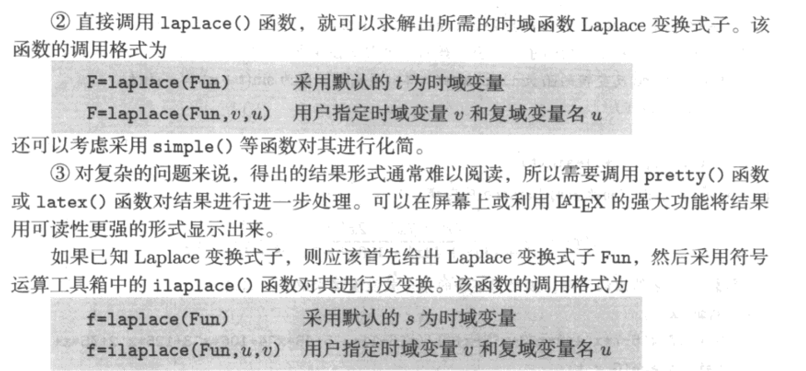
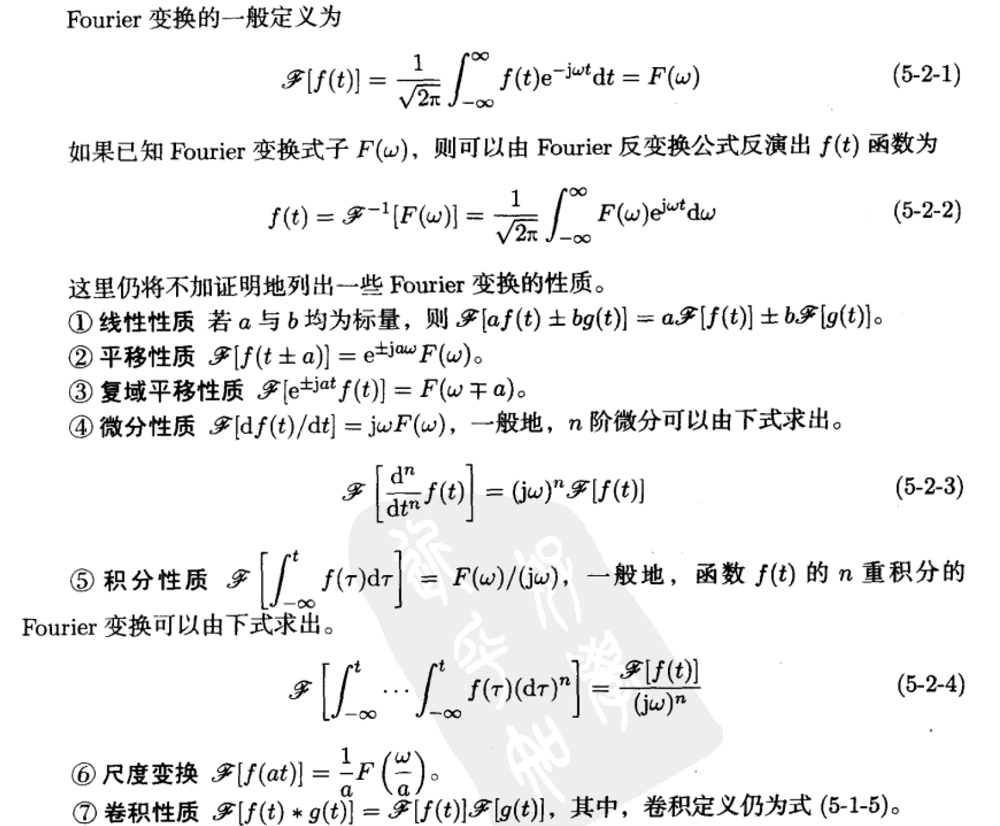
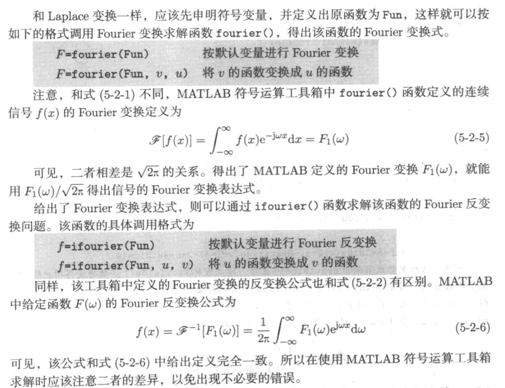

# 积分变化与复变函数问题的计算机求解

## laplace





* laplace
  $$
  t^2\, \mathrm{e}^{- 2\, t}\, \sin\!\left(\pi\, t\right)
$$
  
$$
  \frac{2\, \pi\, {\left(2\, s + 4\right)}^2}{{\left({\left(s + 2\right)}^2 + {\pi}^2\right)}^3} - \frac{2\, \pi}{{\left({\left(s + 2\right)}^2 + {\pi}^2\right)}^2}
$$


$$
- t^2\, \mathrm{e}^{- 2\, t}\, \sin\!\left(t\right)
$$

$$
-\frac{2\, \left(110\, s^5 + 960\, s^4 + 3471\, s^3 + 6660\, s^2 + 6825\, s + 3000\right)}{{\left(s^2 + 4\, s + 5\right)}^3}
$$

$$
\frac{2}{{\left({\left(s + 2\right)}^2 + 1\right)}^2} - \frac{2\, {\left(2\, s + 4\right)}^2}{{\left({\left(s + 2\right)}^2 + 1\right)}^3}
$$


## Fourier







$$
\frac{1}{a^2 + t^2}
$$

$$
\frac{\pi\, \mathrm{e}^{- a\, \left|w\right|}}{a}
$$

$$
\frac{\pi\, \mathrm{e}^{- a\, \left|w\right|}}{a}
$$

$$
\frac{1}{a^2 + x^2}
$$

$$
\frac{\mathrm{e}^{- a\, \left|t\right|}}{\sqrt{\left|t\right|}}
$$

$$
\frac{\sqrt{2}\, \sqrt{\pi}}{2\, \sqrt{\left|w - a\, \mathrm{i}\right|}} + \frac{\sqrt{2}\, \sqrt{\pi}}{2\, \sqrt{\left|w + a\, \mathrm{i}\right|}}
$$


$$
t\, \mathrm{e}^{- a\, t}
$$

$$
\Re\!\left(\frac{1}{{\left(a - w\, \mathrm{i}\right)}^2}\right)
$$

$$
t^2\, \mathrm{e}^{- a\, t}
$$

$$
2\, \Re\!\left(\frac{1}{{\left(a - w\, \mathrm{i}\right)}^3}\right)
$$

$$
t^3\, \mathrm{e}^{- a\, t}
$$

$$
6\, \Re\!\left(\frac{1}{{\left(a - w\, \mathrm{i}\right)}^4}\right)
$$

$$
t^4\, \mathrm{e}^{- a\, t}
$$

$$
24\, \Re\!\left(\frac{1}{{\left(a - w\, \mathrm{i}\right)}^5}\right)
$$

$$
t^5\, \mathrm{e}^{- a\, t}
$$

$$
120\, \Re\!\left(\frac{1}{{\left(a - w\, \mathrm{i}\right)}^6}\right)
$$

$$
t^6\, \mathrm{e}^{- a\, t}
$$

$$
720\, \Re\!\left(\frac{1}{{\left(a - w\, \mathrm{i}\right)}^7}\right)
$$

$$
t^7\, \mathrm{e}^{- a\, t}
$$

$$
5040\, \Re\!\left(\frac{1}{{\left(a - w\, \mathrm{i}\right)}^8}\right)
$$

$$
t^8\, \mathrm{e}^{- a\, t}
$$

$$
40320\, \Re\!\left(\frac{1}{{\left(a - w\, \mathrm{i}\right)}^9}\right)
$$


### 离散傅里叶变换


$$
t^6\, \mathrm{e}^{- a\, t}
$$

$$
40320\, \Re\!\left(\frac{1}{{\left(a - w\, \mathrm{i}\right)}^9}\right)
$$


## 其他积分变换

* Melin


* Hankel


## Z变换及其反变换


### 留数


### 有理函数展开


$$
\frac{2\, s^7 + 2\, s^3 + 8}{s^8 + 30\, s^7 + 386\, s^6 + 2772\, s^5 + 12093\, s^4 + 32598\, s^3 + 52520\, s^2 + 45600\, s + 16000}

$$

$$
\frac{1}{432\, \left(s + 1\right)} + \frac{11}{9\, \left(s + 2\right)} - \frac{1349779}{27\, \left(s + 4\right)} + \frac{193046}{9\, {\left(s + 4\right)}^2} + \frac{7198933}{144\, \left(s + 5\right)} - \frac{16444}{3\, {\left(s + 4\right)}^3} + \frac{341863}{12\, {\left(s + 5\right)}^2} + \frac{13041}{{\left(s + 5\right)}^3}

$$


$$
\frac{\sin\!\left(a\, t\right)}{t}
$$

$$
\arctan\!\left(\frac{a}{s}\right)
$$

$$
t^5\, \sin\!\left(a\, t\right)
$$

$$
\frac{720\, a\, s}{{\left(a^2 + s^2\right)}^4} - \frac{3840\, a\, s^3}{{\left(a^2 + s^2\right)}^5} + \frac{3840\, a\, s^5}{{\left(a^2 + s^2\right)}^6}
$$

$$
t^8\, \cos\!\left(a\, t\right)
$$

$$
\frac{362880\, s}{{\left(a^2 + s^2\right)}^5} - \frac{4838400\, s^3}{{\left(a^2 + s^2\right)}^6} + \frac{17418240\, s^5}{{\left(a^2 + s^2\right)}^7} - \frac{23224320\, s^7}{{\left(a^2 + s^2\right)}^8} + \frac{10321920\, s^9}{{\left(a^2 + s^2\right)}^9}
$$

$$
t^6\, \mathrm{e}^{a\, t}
$$

$$
-\frac{720}{{\left(a - s\right)}^7}
$$

$$
8\, \mathrm{e}^{- 2\, t} + 5\, \mathrm{e}^{- a\, t} + t^4\, \mathrm{e}^{- a\, t}
$$

$$
\frac{8}{s + 2} + \frac{5}{a + s} + \frac{24}{{\left(a + s\right)}^5}
$$

$$
\mathrm{e}^{p\, t}\, \sin\!\left(o + a\, t\right)
$$

$$
\frac{a\, \cos\!\left(o\right)}{{\left(p - s\right)}^2 + a^2} - \frac{\sin\!\left(o\right)\, \left(p - s\right)}{{\left(p - s\right)}^2 + a^2}
$$

$$
6\, \mathrm{e}^{9\, t} + \mathrm{e}^{- 12\, t}
$$

$$
\frac{6}{s - 9} + \frac{1}{s + 12}
$$


$$
-\frac{1}{\left(b + s\right)\, \left(a^2 - s^2\right)\, \sqrt{s^2}}
$$

$$
\left\{ \begin{array}{ccl} \frac{\mathrm{e}^{- a\, z}\, \left(\frac{\mathrm{log}\!\left(-\frac{1}{a}\right)}{2} - \frac{\mathrm{log}\!\left(- a\right)}{2} + \mathrm{log}\!\left(- a\, z\right) - \mathrm{log}\!\left(z\right) + \mathrm{expint}\!\left(- a\, z\right)\right)}{2\, a^2\, \left(a + b\right)} - \frac{\mathrm{e}^{a\, z}\, \mathrm{expint}\!\left(a\, z\right)}{2\, a^2\, \left(a - b\right)} - \frac{\mathrm{laplace}\!\left(\frac{1}{s},s,z\right)}{a^2\, b} + \frac{\mathrm{e}^{b\, z}\, \mathrm{expint}\!\left(b\, z\right)}{b\, \left(a + b\right)\, \left(a - b\right)} & \text{if} & 0 < b\\ \frac{\mathrm{e}^{- a\, z}\, \left(\frac{\mathrm{log}\!\left(-\frac{1}{a}\right)}{2} - \frac{\mathrm{log}\!\left(- a\right)}{2} + \mathrm{log}\!\left(- a\, z\right) - \mathrm{log}\!\left(z\right) + \mathrm{expint}\!\left(- a\, z\right)\right)}{2\, a^2\, \left(a + b\right)} - \frac{\mathrm{e}^{a\, z}\, \mathrm{expint}\!\left(a\, z\right)}{2\, a^2\, \left(a - b\right)} - \frac{\mathrm{laplace}\!\left(\frac{1}{s},s,z\right)}{a^2\, b} + \frac{\mathrm{e}^{b\, z}\, \left(\frac{\mathrm{log}\!\left(\frac{1}{b}\right)}{2} + \mathrm{log}\!\left(b\, z\right) - \frac{\mathrm{log}\!\left(b\right)}{2} - \mathrm{log}\!\left(z\right) + \mathrm{expint}\!\left(b\, z\right)\right)}{b\, \left(a + b\right)\, \left(a - b\right)} & \text{if} & \neg 0 \leq b\\ \end{array} \right.
$$

$$
\sqrt{s - a} - \sqrt{s - b}
$$

$$
\frac{\sqrt{\pi}\, \mathrm{e}^{- a\, z}}{2\, z^{\frac{3}{2}}} - \frac{\sqrt{\pi}\, \mathrm{e}^{- b\, z}}{2\, z^{\frac{3}{2}}} - \frac{{\left(- a\right)}^{\frac{3}{2}}\, \sqrt{\pi}\, \mathrm{e}^{- a\, z}}{2\, {\left(- a\, z\right)}^{\frac{3}{2}}} + \frac{{\left(- b\right)}^{\frac{3}{2}}\, \sqrt{\pi}\, \mathrm{e}^{- b\, z}}{2\, {\left(- b\, z\right)}^{\frac{3}{2}}} + \frac{{\left(- a\right)}^{\frac{3}{2}}\, \mathrm{e}^{- a\, z}\, \left(\frac{\sqrt{\pi}\, \mathop{\mathrm{erfc}}\nolimits\!\left(\sqrt{- a\, z}\right)}{2} + \mathrm{e}^{a\, z}\, \sqrt{- a\, z}\right)}{{\left(- a\, z\right)}^{\frac{3}{2}}} - \frac{{\left(- b\right)}^{\frac{3}{2}}\, \mathrm{e}^{- b\, z}\, \left(\frac{\sqrt{\pi}\, \mathop{\mathrm{erfc}}\nolimits\!\left(\sqrt{- b\, z}\right)}{2} + \mathrm{e}^{b\, z}\, \sqrt{- b\, z}\right)}{{\left(- b\, z\right)}^{\frac{3}{2}}}
$$

$$
\mathrm{log}\!\left(\frac{a - s}{b - s}\right)
$$

$$
\mathrm{laplace}\!\left(\mathrm{log}\!\left(\frac{a - s}{b - s}\right),s,z\right)
$$

$$
\frac{1}{\sqrt{s}\, \left(a + s\right)}
$$

$$
\frac{\pi\, \mathrm{e}^{a\, z}\, \mathop{\mathrm{erfc}}\nolimits\!\left(\sqrt{a\, z}\right)}{\sqrt{a}}
$$

$$
\frac{3\, a^2}{a^3 + s^3}
$$

$$
\mathrm{e}^{a\, z}\, \mathrm{expint}\!\left(a\, z\right) + 2\, a\, \mathrm{laplace}\!\left(\frac{1}{a^2 - a\, s + s^2},s,z\right) - \mathrm{laplace}\!\left(\frac{s}{a^2 - a\, s + s^2},s,z\right)
$$

$$
\frac{{\left(s - 1\right)}^8}{s^7}
$$

$$
28\, \mathrm{laplace}\!\left(\frac{1}{s},s,z\right) - \frac{8\, z - 1}{z^2} - 56\, \mathrm{laplace}\!\left(\frac{1}{s^2},s,z\right) + 70\, \mathrm{laplace}\!\left(\frac{1}{s^3},s,z\right) - 56\, \mathrm{laplace}\!\left(\frac{1}{s^4},s,z\right) + 28\, \mathrm{laplace}\!\left(\frac{1}{s^5},s,z\right) - 8\, \mathrm{laplace}\!\left(\frac{1}{s^6},s,z\right) + \mathrm{laplace}\!\left(\frac{1}{s^7},s,z\right)
$$

$$
\mathrm{log}\!\left(\frac{a^2 + s^2}{b^2 + s^2}\right)
$$

$$
\mathrm{laplace}\!\left(\mathrm{log}\!\left(\frac{a^2 + s^2}{b^2 + s^2}\right),s,z\right)
$$

$$
\frac{s^2 + 3\, s + 8}{\left(s + 1\right)\, \left(s + 2\right)\, \left(s + 3\right)\, \left(s + 4\right)\, \left(s + 5\right)\, \left(s + 6\right)\, \left(s + 7\right)\, \left(s + 8\right)}
$$

$$
\frac{\mathrm{e}^{3\, z}\, \mathrm{expint}\!\left(3\, z\right)}{30} - \frac{\mathrm{e}^{2\, z}\, \mathrm{expint}\!\left(2\, z\right)}{120} - \frac{\mathrm{e}^{4\, z}\, \mathrm{expint}\!\left(4\, z\right)}{12} + \frac{\mathrm{e}^{5\, z}\, \mathrm{expint}\!\left(5\, z\right)}{8} - \frac{13\, \mathrm{e}^{6\, z}\, \mathrm{expint}\!\left(6\, z\right)}{120} + \frac{\mathrm{e}^{7\, z}\, \mathrm{expint}\!\left(7\, z\right)}{20} - \frac{\mathrm{e}^{8\, z}\, \mathrm{expint}\!\left(8\, z\right)}{105} + \frac{\mathrm{e}^{z}\, \mathrm{expint}\!\left(z\right)}{840}
$$

$$
-\frac{\frac{a}{2} + \frac{s}{2}}{a - s}
$$

$$
\frac{1}{2\, z} + a\, \mathrm{e}^{- a\, z}\, \left(\frac{\mathrm{log}\!\left(-\frac{1}{a}\right)}{2} - \frac{\mathrm{log}\!\left(- a\right)}{2} + \mathrm{log}\!\left(- a\, z\right) - \mathrm{log}\!\left(z\right) + \mathrm{expint}\!\left(- a\, z\right)\right)
$$


# 代数方程与最优化问题的计算机求解


### 代数方程的求解

* 一元方程

  

  

* 二元方程

  

  

  
$$
  x^2\, \mathrm{e}^{-\frac{x\, y^2}{2}} + \mathrm{e}^{-\frac{x}{2}}\, \sin\!\left(x\, y\right)
$$
  

  
$$
  y^2\, \cos\!\left(x^2 + y\right) + x^2\, \mathrm{e}^{x + y}
$$


* solve
$$
  \left(\begin{array}{c} \frac{8\, a + \sqrt{3}\, \sqrt{ - 16\, a - 8\, b - 8\, a\, b - 4\, a^2 - 9} + 2\, a^2 + 3}{2\, \left(a + 1\right)} - a - 3\\ \frac{8\, a - \sqrt{3}\, \sqrt{ - 16\, a - 8\, b - 8\, a\, b - 4\, a^2 - 9} + 2\, a^2 + 3}{2\, \left(a + 1\right)} - a - 3 \end{array}\right)

$$


$$
\left(\begin{array}{c} \frac{8\, a + \sqrt{3}\, \sqrt{ - 16\, a - 8\, b - 8\, a\, b - 4\, a^2 - 9} + 2\, a^2 + 3}{2\, \left(a + 1\right)}\\ \frac{8\, a - \sqrt{3}\, \sqrt{ - 16\, a - 8\, b - 8\, a\, b - 4\, a^2 - 9} + 2\, a^2 + 3}{2\, \left(a + 1\right)} \end{array}\right)
$$

$$
\left(\begin{array}{c} \frac{\sqrt{3}\, \sqrt{ - 16\, a - 8\, b - 8\, a\, b - 4\, a^2 - 9} - 3}{2\, \left(a + 1\right)}\\ -\frac{\sqrt{3}\, \sqrt{ - 16\, a - 8\, b - 8\, a\, b - 4\, a^2 - 9} + 3}{2\, \left(a + 1\right)} \end{array}\right)

$$

$$
\left(\begin{array}{c} \frac{8\, a + \sqrt{3}\, \sqrt{ - 16\, a - 8\, b - 8\, a\, b - 4\, a^2 - 9} + 2\, a^2 + 3}{2\, \left(a + 1\right)}\\ \frac{8\, a - \sqrt{3}\, \sqrt{ - 16\, a - 8\, b - 8\, a\, b - 4\, a^2 - 9} + 2\, a^2 + 3}{2\, \left(a + 1\right)} \end{array}\right)

$$


* fsolve

  


​	

用图解法选择初始值，再用数值解法得到任意初始值下的数值解。


​	


​	


### 基于MATLAB的数值解法


* inline+Display  ‘iter'  

 Iteration   Func-count     min f(x)         Procedure
     0            1                0         
     1            3     -0.000499937         initial simplex
     2            4     -0.000499937         reflect
     3            6      -0.00149944         expand
     4            7      -0.00149944         reflect
     5            9      -0.00349693         expand
     6           11      -0.00449492         expand
     7           13      -0.00897961         expand
     8           15       -0.0132057         expand
     9           17       -0.0242237         expand
    10           19       -0.0380572         expand
    11           21       -0.0665133         expand
    12           23        -0.107177         expand
    13           25        -0.180092         expand
    14           27        -0.285368         expand
    15           29        -0.440495         expand
    16           31        -0.595822         expand
    17           33        -0.631877         reflect
    18           34        -0.631877         reflect
    19           36        -0.631877         contract inside
    20           38        -0.631877         contract inside
    21           40        -0.633521         contract inside
    22           42        -0.634432         contract inside
    23           43        -0.634432         reflect
    24           45        -0.634432         contract inside
    25           47        -0.634432         contract outside
    26           49        -0.634467         contract inside
    27           51        -0.634477         reflect
    28           53        -0.634514         reflect
    29           55        -0.634521         reflect
    30           57        -0.634561         reflect
    31           59        -0.634565         reflect
    32           61        -0.634608         reflect
    33           63        -0.634609         reflect
    34           65        -0.634654         reflect
    35           66        -0.634654         reflect
    36           68        -0.634701         reflect
    37           70        -0.634715         contract inside
    38           72        -0.634774         expand
    39           74        -0.634774         contract inside
    40           76        -0.634874         expand
    41           77        -0.634874         reflect
    42           79        -0.635056         expand
    43           81        -0.635142         expand
    44           83        -0.635607         expand
    45           85        -0.635736         expand
    46           87        -0.636813         expand
    47           88        -0.636813         reflect
    48           90        -0.638098         expand
    49           92         -0.63934         expand
    50           94        -0.640506         expand
    51           96        -0.641386         reflect
    52           98        -0.641386         contract outside
    53           99        -0.641386         reflect
    54          101        -0.641386         contract outside
    55          103        -0.641386         contract inside
    56          105          -0.6414         contract inside
    57          107        -0.641407         contract inside
    58          109        -0.641423         contract inside
    59          111        -0.641423         contract outside
    60          113        -0.641423         contract inside
    61          115        -0.641423         reflect
    62          117        -0.641423         contract outside
    63          119        -0.641424         contract inside
    64          121        -0.641424         contract inside
    65          123        -0.641424         contract inside
    66          125        -0.641424         reflect
    67          127        -0.641424         contract inside
    68          129        -0.641424         contract inside
    69          131        -0.641424         contract inside
    70          133        -0.641424         contract inside
    71          135        -0.641424         contract inside
    72          137        -0.641424         contract outside

优化已终止:
 当前的 x 满足使用 1.000000e-04 的 OPTIONS.TolX 的终止条件，
F(X) 满足使用 1.000000e-04 的 OPTIONS.TolFun 的收敛条件

```matlab
0.6111   -0.3056
```


警告: **Gradient must be provided for trust-region algorithm; using**
quasi-newton algorithm instead.

> In fminunc (line 397) 
>                                                    First-order 
>  Iteration  Func-count       f(x)        Step-size       optimality
> 0           3                0                             2
> 1           6        -0.367879            0.5          0.736  
> 2           9        -0.571873              1          0.483  
> 3          15        -0.632398       0.284069          0.144  
> 4          18        -0.638773              1          0.063  
> 5          21         -0.64141              1        0.00952  
> 6          24        -0.641424              1       0.000619  
> 7          27        -0.641424              1        1.8e-06  

Local minimum found.

Optimization completed because the size of the gradient is less than
the default value of the optimality tolerance.

<stopping criteria details>

    0.6110

   -0.3055


**%   When options.LargeScale=='on', the algorithm is a trust-region method.**
**%   When options.LargeScale=='off', the algorithm is the BFGS Quasi-Newton** 
**%   method with a mixed quadratic and cubic line search procedure.** 


[1] Broyden, C. G. "The Convergence of a Class of Double-Rank Minimization Algorithms." *Journal Inst. Math. Applic*., Vol. 6, 1970, pp. 76–90.


[2] Coleman, T. F. and Y. Li. "An Interior, Trust Region Approach for Nonlinear Minimization Subject to Bounds." *SIAM Journal on Optimization*, Vol. 6, 1996, pp. 418–445.


[3] Coleman, T. F. and Y. Li. "On the Convergence of Reflective Newton Methods for Large-Scale Nonlinear Minimization Subject to Bounds." *Mathematical Programming*, Vol. 67, Number 2, 1994, pp. 189–224.


[4] Davidon, W. C. "Variable Metric Method for Minimization." *A.E.C. Research and Development Report*, ANL-5990, 1959.


[5] Fletcher, R. "A New Approach to Variable Metric Algorithms." *Computer Journal*, Vol. 13, 1970, pp. 317–322.


[6] Fletcher, R. "Practical Methods of Optimization." Vol. 1, *Unconstrained Optimization*, John Wiley and Sons, 1980.


[7] Fletcher, R. and M. J. D. Powell. "A Rapidly Convergent Descent Method for Minimization." *Computer Journal*, Vol. 6, 1963, pp. 163–168.


[8] Goldfarb, D. "A Family of Variable Metric Updates Derived by Variational Means." *Mathematics of Computing*, Vol. 24, 1970, pp. 23–26.


[9] Shanno, D. F. "Conditioning of Quasi-Newton Methods for Function Minimization." *Mathematics of Computing*, Vol. 24, 1970, pp. 647–656.


### 利用梯度求解最优化问题


### 有约束的最优化


### 线性规划问题


