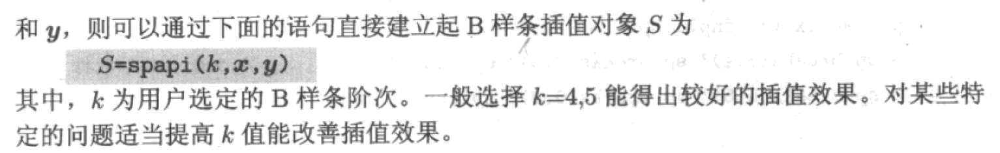
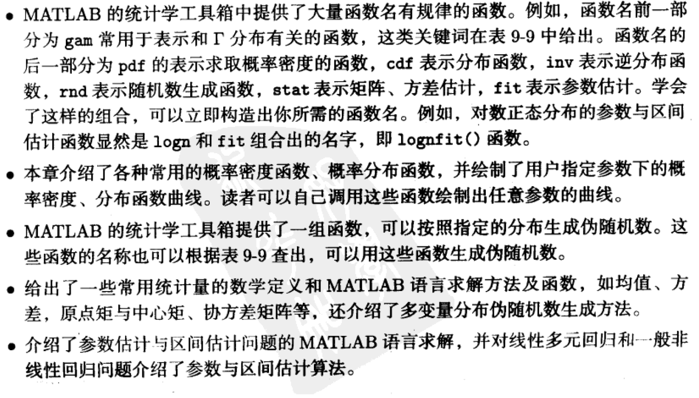

# 数据差值、函数逼近问题

## interp1 and lagrange

'''

[x0,y0]=ginput(6);
x=min(x0):(max(x0)-min(x0))/8:max(x0);
y=lagrange1(x0,y0,x);
plot(x0,y0,'o')
hold on
plot(x,y,'ro')

'''

## 已知样本点的定积分

* trapz;  interp1(一维数据)

* quadspln

* interp2(二维插值)

  

* 二维一般分布数据的插值问题。 interp2只能处理以网格形式给出的数据，如果已知数据不是以网格形式给出，该函数无能为力。

* 高维插值问题===n维

## 样条插值

### 三次样条

#### 多个自变量的网格数据三次样条插值

### B样条函数

### 基于样条插值的数值微积分运算

积分

## 已知数据拟合数学模型

### 多项式拟合

p3=polyfit(x0,y0,3);
vpa(poly2sym(p3),10)

### 8.3.5 最小二乘曲线拟合

$$
[a,J_m]=lsqcurvefit(Fun,a_0,x,y)
$$

Fun: M-函数或者inline()

a0 :最优化的初值

## 8.4 信号分析与数字信号处理基础

### 8.4.1 相关分析

$$
R_{xx}(\rho)=lim_{T\rightarrow\infty}\frac{1}{T}\int_0^Tx(t)x(t+\rho)dt,\rho\ge0
$$

### 8.4.2 快速Fourier变换

$$
X(k)=\sum_{i=1}^Nx_ie^{-2\pi j(k-1)(i-1)/N}
$$

逆变换
$$
x(k)=\frac{1}{N}\sum_{i=1}^NX(i)e^{2\pi j(k-1)(i-1)/N}
$$

fft

### 8.4.3 滤波技术与滤波器设计

* 线性滤波器

  * FIR
  * IIR
  * ARMA

  

  

* 放大倍数分析

  

* 滤波器设计

## summary

# 第九章 概率论与数理统计问题的计算机求解

## 9.1 概率分布与伪随机数生成

### 9.1.2 常见

* poisson

  * 概率密度函数：poisspdf(x,lambda)
  * 分布函数：poisscdf(x,lambda)
  * 逆概率分布：x=poissinv(F,lambda)

  $$
  p_p(x)=\frac{\lambda^x}{x!}e^{-\lambda x}
  $$

  

* norm

  * normpdf(x,miu,sigma)
  * normcdf(x,miu,sigma)
  * norminv(F,miu,sigma)

  $$
  p_n(x)=\frac{1}{\sqrt{2\pi \sigma}}e^{-\frac{(x-\mu)^2}{2\sigma^2}}
  $$

  

* gamma 分布

  * gampdf(x,a,lambda)
  * gamcdf(x,a,lambda)
  * gaminv(F,a,lambda)

  $$
  \begin{aligned}
  p(x)
  &=\frac{\lambda^ax^{a-1}}{\Gamma(a)}e^{-\lambda x}\space for \space x\ge0
  \\
  &=0 \space for \space x<0
  \end{aligned}
  $$

  

* chi 分布

  * chi2pdf(x,k)
  * chi2cdf(x,k)
  * chi2inv(F,k)

  $$
  \begin{aligned}
  p(x)_{\chi^2}
  &=\frac{1}{2^{\frac{k}{2}}\Gamma(\frac{k}{2})} x^{\frac{k}{2}-1}e^{-\frac{x}{2}} \space for \space x\ge0
  \\
  &=0 \space for \space x<0
  \end{aligned}
  $$

  

* T分布

  * tpdf(x,k)
  * tcdf(x,k)
  * tinv(F,k)

  $$
  p_T(x)=\frac{\Gamma(\frac{k+1}{2})}{\sqrt{k\pi}\Gamma(\frac{k}{2})}(1+\frac{x^2}{k})^{-\frac{k+1}{2}}
  $$

  

* rauleigh

  * raylpdf
  * raylcdf
  * raylinv

  $$
  \begin{aligned}
  p(x)_{r}
  &=\frac{x}{b^2}e^{-\frac{x^2}{2b^2}}
  \space for \space x\ge0
  \\
  &=0 \space for \space x<0
  \end{aligned}
  $$

  

* F

  * fpdf(x,p,q)
  * fcdf(x,p,q)
  * finv(F,p,q)

  $$
  \begin{aligned}
  p(x)_{F}
  &=\frac{\Gamma(\frac{p+q}{2})}{\Gamma(\frac{p}{2})\Gamma({\frac{q}{2}})}p^{\frac{p}{2}}q^{\frac{q}{2}}x^{\frac{p}{2}-1}(p+qx)^{-\frac{p+q}{2}}
  \space for \space x\ge0
  \\
  &=0 \space for \space x<0
  \end{aligned}
  $$

  

### 9.1.3 概率问题的求解

### 9.1.4 随机数与伪随机数

## 9.2 统计量分析

### 9.2.1 随机变量的均值与方差

* 对于给出概率分布

$$
E[x]=\int_{-\infty}^{\infty}xp(x)dx
\\
D[x]=\int_{-\infty}^{\infty}(x-E[x])^2p(x)dx
$$

* 对于给出样本数据

* 对于给定概率分布的参数

### 9.2.2 随机变量的矩

### 9.2.3 多变量随机数协方差分析

### 9.2.4 多变量正太分布

## 9.3 数理统计分析方法与计算机实现

### 9.3.1 参数估计与区间估计

### 9.3.2  多元线性回归与区间估计

### 9.3.3 非线性函数的最小二乘法参数估计与区间估计

J: Jacobi 

lsqcurvefit

##  9.4 统计假设检验

### 9.4.1

*  引入两个命题
* 选取统计量
* 显著性水平
* 逆分布求出相应

### 9.4.2 假设检验问题求解

**正态分布均值假设检验**

* ttest
* ztest

**正态分布假设检验**

## 9.5 方差分析

### 9.5.1 单因子方差分析

anova2

manova1

## 9.6 summary

# 第十章 数学问题的非传统解法

## 10.1 模糊逻辑和模糊推理

