# Chapter 2

## Multi-armed Bandits

features of rl:

​	It uses information that evaluates the actions taken rather than instructs by giving correct actions.


active exploration

evaluate feedback: how good the action taken was

Instructive feedback: the correct action to taken.

**distinct feedbacks**

* evaluative feedback depends entirely on the action taken
* instructive feedback which is independent of the action taken


### 2.1 k-armed Bandits


Through repeated action selections you are to maximize your winnings by concentrating your actions on the best levels.


Each of the k actions has an expected or mean reward given that the action is selected.

**The value of the action**

A<sub>t</sub>: **action for the time step t**

R<sub>t</sub>: **corresponding reward**

q<sub>*</sub>(a): **the expected reward when taking the action a**

Q<sub>t</sub>(a): **the estimated value of the action a at time step t**

q<sub>*</sub>(a)=E(R<sub>t</sub>|A<sub>t</sub>=a)


If we do not know the expected reward:

would like the estimated value Q<sub>t</sub>(a) to be q<sub>*</sub>(a)


**Greedy action**: At any step there is at least one action whose estimated value is greatest, you choose it.

**Exploiting**: choosing Greedy actions

**Exploring**: Choosing non-greedy actions

**Exploitation is the right thing to do to maximize the expected reward on the one step, but exploration may produce the greater total reward in the long run.**

Balance!!!


### 2.2 Action-value Methods


**sum of rewards when a taken prior to t** and **number of times a taken prior to t**
$$
\sum_{i=1}^n R_i *Times(A_i=1) \div \sum_{i=1}^n Times(A_i=1)
$$


***sample-average Method* ** for estimating action values because each estimate is an average of the sample of relevant rewards.


**Action selection rule**

* gready: exploits current knowledge to maximize immediate reward
  $$
  A_t= argmax_a Q_t(a)
  $$
  
* $$
  \epsilon-greedy method
  $$

  behave greedily most of the time

  but with small probability P,select randomly from among all the actions with equal probability, independent of the action-value estimates
  $$
  P=\epsilon
  $$
  

  **Advantage**: in the limit as the number of steps increases, every action will be sampled an infinite number of times, which will ensure that all Q<sub>t</sub>(a) converge to q<sub>*</sub>(a)

  

### 2.3 The 10-armed Testbed


**The advantage of epsilon-greedy methods depends on the task**

With noisier rewards it takes more exploration to find the optimal action, epsilon-greedy methods should fare even better relative to the greedy method.

If the reward variances were zero, Then the greed method would know the true value of each action after trying it once.


Even in the deterministic case there is a large advantage to exploring if we weaken some of the other assumption. For example: the bandit task were non-stationary that is the true values of the actions changed over time.


### 2.4 Incremental Implementation

Efficient Manner: in particular, constant memory and constant per-time-step computation


R<sub>i</sub>: the reward after the i_th selection of this action

Q<sub>n</sub>: the estimate of its action value after it has been selected n-1 times
$$
Q_n=\frac{R_1+R_2+...+R_n}{n-1}
$$


But: **it would maintain a record of all the rewards and cost lots of computation and memory**


$$
Q_{n+1}=\frac{1}{n}\sum_{i=1}^nR_i
\\Q_{n+1}=\frac{1}{n}(R_n+\sum_{i=1}^{n-1}R_i)
\\Q_{n+1}=\frac{1}{n}(R_n+(n-1)\frac{1}{n-1}\sum_{i=1}^{n-1}R_i)
\\Q_{n+1}=\frac{1}{n}(R_n+(n-1)Q_{n})
\\Q_{n+1}=Q_{n}+\frac{1}{n}(R_n-Q_n)
$$


which will use small computation and memory


**Update Rule**
$$
NewEstimate=OldEstimate + StepSize[Target-OldEstimate]
$$

$$
[Target-OldEstimate] : error
$$


**A simple bandit algorithm**

Initialize for a =1 to k

​	Q(a)=0

​	N(a)=0

Loop forever

​	A use epsilon-greedy algorithm

​	R=bandit(A)  (the reward for action A)

​	N(A)=N(A)+1

​	Q(A)=Q(A)+[R-Q(A)]/N(A)

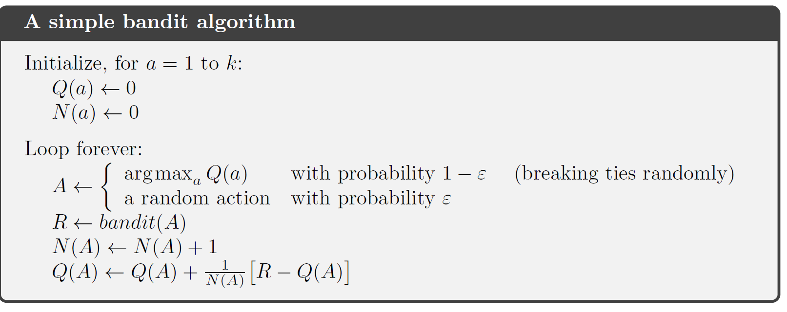

### 2.5 Tracking a Non-stationary Problem


We often encounter rl problems that are effectively non-stationary.


**ways**: change 1/n to a constant step-size parameter
$$
\\Q_{n+1}=Q_{n}+\alpha(R_n-Q_n)
$$

$$
\\Q_{n+1}=Q_{n}+\alpha(R_n-Q_n)
\\Q_{n+1}=\alpha R_{n}+(1-\alpha) Q_n
\\Q_{n+1}=\alpha R_{n}+(1-\alpha)(\alpha R_{n-1}+(1-\alpha) Q_{n-1})
\\Q_{n+1}=\alpha R_{n}+\alpha(1-\alpha) R_{n-1}+(1-\alpha)^2 Q_{n-1}
\\Q_{n+1}=(1-\alpha)^n Q_{1}+\sum_{i=1}^n\alpha(1-\alpha)^{n-i} R_{i}
$$
**Conditions** can be met by 1/n


* the steps are large enough to eventually overcome any initial conditions or random fluctuations
* eventually the steps become small enough to ensure convergence **( second can not be met by alpha)**


$$
\alpha_n(a)=\frac{1}{n}
$$

$$
\alpha_n(a)=\alpha(1-\alpha)^{n-i}
$$


### 2.6 Optimistic Initial Values

All the methods above are *biased* by the initial action-value estimates


The kind of bias is usually not a problem and can sometimes be very helpful

* downside: the initial estimates become a set of parameters that must be picked by users
* upside: provide an easy way to supply some prior knowledge about what level of rewards can be expected


**Initial action values can also be used as a simple way to encourage exploration**


### 2.7 Upper-Confidence-Bound Action selection


epsilon-greedy

* forces the non-greedy actions to be tried
* no preference for those that are nearly greedy or particularly uncertain.

Improvement

* select among the non-greedy actions according to their potential for actually being optimal, taking into account both how close their estimates are to being maximal and the uncertainties in those estimates


***UCB (Upper Confidence Bound)***
$$
A_t=argmax_a[A_t(a)+c\sqrt\frac{ln t}{N_t(a)}
$$
ln(t): the natural logarithm of t

N<sub>t</sub>(a): the number of times that action a has been selected prior to time t

c: controls the degree of exploration


### 2.8 Gradient Bandit Algorithms

Above:

* estimate action values and use the estimations to select actions


Now:

**The numerical preference for each action a : H<sub>t</sub>(a)**

* if we add 1000 to all the action preferences there is no effect on the action probabilities.


$$
P(A_t=a)=\frac{e^{H_t(a)}}{\sum_{b=1}^ke^{H_t(b)}}=\pi_t(a)
$$


probability of taking action a at time t
$$
\pi_t(a)
$$


Stochastic gradient ascent

on each step, after selecting action A<sub>t</sub> and receive reward R<sub>t</sub> . the action preferences are updated 
$$
H_{t+1}(A_t)=^{update}H_t(A_t)+\alpha(R_t-R_{t}^{average})(1-\pi_t(A_t))
\\H_{t+1}(a)=^{update}H_t(a)-\alpha(R_t-R_{t}^{average})\pi_t(a)   \space for \space a\not=A_t
$$


the average of all the rewards serves as baseline with which the reward is compared.

If the reward is higher than the baseline, then the probability of taking A<sub>t</sub> in the future is increased, and if the reward is below baseline, then probability is decreased.


#### the Bandit Gradient Algorithm as Stochastic Gradient Ascent.


In exact gradient ascent, each preference H<sub>t</sub>(a) would be incremented proportional to the increment's effect on performance:
$$
H_{t+1}(a)=H_t(a)+\alpha\frac{\part{E(R_t)}}{\part{H_t(a)}}

\\ E[R_t]=\sum_{x}\pi_t(x)q_*(x)
$$


We do not know the q<sub>*</sub>(x)


$$
\frac{\part{E(R_t)}}{\part{H_t(a)}}
=\frac{\part{}}{\part{H_t(a)}}[\sum_{x}\pi_t(x)q_*(x)]
=\sum_{x}\frac{\part{\pi_t(x)}}{\part{H_t(a)}}q_*(x)
=\sum_{x}\frac{\part{\pi_t(x)}}{\part{H_t(a)}}[q_*(x)-B_t]
$$


B<sub>t</sub> is the baseline

we can include a baseline here without changing the equality because the gradient sums to zero over all actions.
$$
\frac{\part{E(R_t)}}{\part{H_t(a)}}
\\=\sum_{x}\pi_t(x)\frac{\part{\pi_t(x)}}{\part{H_t(a)}}[q_*(x)-B_t]/\pi_t(x)
\\=E[(q_*(A_t)-B_t)\frac{\part{\pi_t(A_t)}}{\part{H_t(a)}}/\pi_t(A_t)]
\\=E[(R_t-R_{t}^{average})\frac{\part{\pi_t(A_t)}}{\part{H_t(a)}}/\pi_t(A_t)]
$$


Soft max 


So we can get
$$
H_{t+1}(A_t)=^{update}H_t(A_t)+\alpha(R_t-R_{t}^{average})(1-\pi_t(A_t))
\\H_{t+1}(a)=^{update}H_t(a)-\alpha(R_t-R_{t}^{average})\pi_t(a)   \space for \space a\not=A_t
$$


**the choice of the baseline does not affect the expected update of the algorithm, but it does affect the variance of the update and thus the rate of convergence**


### 2.9 Associative Search

Non-associative tasks

* there is no need to associate different actions with different situations


More than one situation

* policy: a mapping from situation to the actions that are best in those situations


**full reinforcement learning problem**: If actions are allowed to affect the next situation as well as the reward


### 2.10 Summary


# Chapter 3 

## Finite Markov Decision Processes


* evaluative feedback
* choosing  different actions in different situations

MDPS

* actions influence not just immediate rewards but also subsequent situations or states
* involve delayed reward and trade-off immediate and delayed reward


### 3.1 The Agent-Environment Interface


*agent*: the learner and decision maker

*environment*: the thing the agent interacts with, comprising everything outside the agent


*trajectory*
$$
S_0,A_0,R_1
\\S_1,A_1,R_2
\\S_2,A_2,R_3
\\....
$$


Finite MDP

* the random variables R<sub>t</sub> and S<sub>t</sub> have defined discrete probability distributions dependent only on the **preceding** state and action

$$
p(s',r |s,a)=Pr(S_t=s',R_t=r|S_{t-1}=s,A_{t-1}=a)
$$


$$
\sum_{s'\in S}\sum_{r\in R}p(s',r|s,a)=1
$$


Expected rewards for state-action pairs:
$$
r(s,a)=E(R_t|S_{t-1}=s,A_{t-1}=a)=\sum_{r\in R}r\sum_{s' \in S}p(s',r|s,a)
$$


Expected rewards for state-action-next state pairs
$$
r(s,a,s')=E(R_t|S_{t-1}=s,A_{t-1}=a,S_t=s')=\sum_{r\in R}r \frac{p(s',r|s,a)}{p(s'|s,a)}
$$


### Goals and Rewards

The agent's goal is to maximize the total amount of reward it receives

This means maximizing not immediate reward, but cumulative reward in the long run.

**The reward hypothesis**

* that all of what we mean by goals and purposes can be well thought of as the maximization of the expected value of the cumulative sum of a received scalar signal(reward)


### Returns and Episodes

*The cumulative reward*

*expected return*
$$
G_t=R_{t+1}+R_{t+2}+....+R_T
$$


*discounting*
$$
\begin{aligned}
G_t
&=R_{t+1}+\gamma R_{t+2}+\gamma^2R_{t+3}+....\\
&=\sum_{k=0}^{\infty}\gamma^kR_{t+k+1}
\end{aligned}
$$

$$
\begin{aligned}
G_t
&=R_{t+1}+\gamma R_{t+2}+\gamma^2R_{t+3}+....\\
& = R_{t+1}+\gamma(R_{t+2}+\gamma R_{t+3}+...)  \\
&=R_{t+1}+\gamma G_{t+1}
\end{aligned}
$$


### 3.4 Unified Notation for Episodic and Continuing Tasks


tasks

* a sequence of separate episodic tasks
* continuing tasks


S<sub>t,i</sub> : the state representation at time of episode i


### 3.5 Policies and Value Functions


**value function**: function of states that estimate *how good* it is for the agent to be in a given state(expected return)


value functions are defined with respect to particular ways of acting called policies

policy: a map from states to probabilities of selecting each possible action.
$$
\pi(A_t=a|S_t=s)
$$
means the probability that if S<sub>t</sub>=s then  A<sub>t</sub>=a


action value function for policy 
$$
q_\pi(s,a)=E_\pi(G_t|S_t=s,A_t=a)=E_\pi(\sum_{k=0}^{\infty} \gamma^k R_{t+k+1}|S_t=s,A_t=a)
$$


Monte Carlo methods: involve averaging over many random samples of actual returns


**Bellman Equation**: a relationship between the value of a state and the values of its successor states


$$
\begin{aligned}
v_\pi(s)
&=E_\pi(G_t|S_t=s)
\\&=E_\pi(R_{t+1}+\gamma G_t |S_t=s)
\\&= \sum_a\pi(a|s)\sum_{s'}\sum_r p(s',r|s,a)\left[r+\gamma E_\pi(G_t|S_{t+1}=s')\right]
\\&=\sum_a\pi(a|s)\sum_{s',r}p(s',r|s,a)[r+\gamma v_\pi(s')]
\end{aligned}
$$


The value of the start state must be equal to the (discounted) value of the expected next state, plus the reward expected along the way


### 3.6 Optimal Policies and Optimal Value Functions


A policy is defined to be better than or equal to  another policy if its expected return is greater than or equal to than of another for all states.
$$
\pi>\pi' 
\\if \space and \space only \space if
\\v_\pi(s)>v_{\pi'}(s)
\\for \space all \space s\in S
$$


There is always at least one policy that is better than or equal to all other policies.
$$
v_*(s)=max_\pi v_\pi(s)
\\ for \space all \space s\in S
$$

$$
q_*(s,a)=max_\pi(s,a)
\\
q_*(s,a)=E(R_{t+1}+\gamma v_*(S_{t+1})|S_t=s,A_t=a)
$$


**Bellman optimality equation**: the value of a state under an optimal policy must equal the expected return for best action from the state.
$$
\begin{aligned}
v_*(s)
&=max_{a\in A(s)}q_{\pi_*}(s,a)
\\
&=max_a E_{\pi_*}[G_t|S_t=s,A_t=a]
\\
&=max_aE_{\pi_*}[R_{t+1}+\gamma G_{t+1}|S_t=s,A_t=a]
\\
&=max_a E_[R_{t+1}+\gamma v_*(S_{t+1})|S_t=s,A_t=a]
\\
&=max_a \sum_{s',r}p(s',r|s,a)[r+\gamma v_*(s')]
\end{aligned}
$$


$$
\begin{aligned}
q_*(s,a)
&=E[R_{t+1}+\gamma max_{a'}q_*(S_{t+1},a'|S_t=s,A_t=a)]
\\
&=\sum_{s',r}p(s',r|s,a)[r+\gamma q_*(s',a')]
\end{aligned}
$$


if we have optimal value function, we will easily get an optimal policy.

Optimal value function: if one uses it to evaluate the short-term consequences of action, then a greedy policy is actually optimal in the long-term sense. because it already takes  into account the reward consequences of all possible future behavior.


### 3.7 Optimality and Approximation


A critical aspect of the problem facing the agent is always the computational power available to it, in particular, the amount of computation it can perform in a single time step.


Memory

A large amount of memory is often required to build up approximations of value functions, policies and models.

Tabular Methods state(or state-action pair)


probability to select suboptimal actions for them has little impact on the amount of reward the agent receives.


## 3.8 Summary


# Chapter 4

## Dynamic Programming


Classical DP algorithms are of limited utility in reinforcement learning both because of their assumption of a perfect model and because of their great computational expense, but they are still important theoretically.


The key of DP:

* use of value functions to organize the structure the search for good policies.


$$
\begin{aligned}
v_*(s)
&=max_{a\in A(s)}q_{\pi_*}(s,a)
\\
&=max_a E_{\pi_*}[G_t|S_t=s,A_t=a]
\\
&=max_aE_{\pi_*}[R_{t+1}+\gamma G_{t+1}|S_t=s,A_t=a]
\\
&=max_a E_[R_{t+1}+\gamma v_*(S_{t+1})|S_t=s,A_t=a]
\\
&=max_a \sum_{s',r}p(s',r|s,a)[r+\gamma v_*(s')]
\end{aligned}
$$


$$
\begin{aligned}
q_*(s,a)
&=E[R_{t+1}+\gamma max_{a'}q_*(S_{t+1},a'|S_t=s,A_t=a)]
\\
&=\sum_{s',r}p(s',r|s,a)[r+\gamma q_*(s',a')]
\end{aligned}
$$

### 4.1 policy Evaluation

the probability of taking action a in state s under policy 
$$
\begin{aligned}
v_\pi(s)
&=E_\pi(G_t|S_t=s)
\\&=E_\pi(R_{t+1}+\gamma G_t |S_t=s)
\\&= \sum_a\pi(a|s)\sum_{s'}\sum_r p(s',r|s,a)\left[r+\gamma E_\pi(G_t|S_{t+1}=s')\right]
\\&=\sum_a\pi(a|s)\sum_{s',r}p(s',r|s,a)[r+\gamma v_\pi(s')]
\end{aligned}
$$


change it to **iterative solution methods**
$$
\begin{aligned}
v_{k+1}(s)
&=\sum_a\pi(a|s)\sum_{s',r}p(s',r|s,a)[r+\gamma v_k(s')]
\end{aligned}
$$


### 4.2 Policy Improvement


$$
q_\pi(s,\pi'(s))\geq v_\pi(s)
$$
for all states
$$
v_{\pi'}(s)\geq v_\pi(s)
$$

$$
\begin{aligned}
v_\pi(s)
&\leq q_\pi(s,\pi'(s))
\\
&=E[R_{t+1}+\gamma v_\pi(S_{t+1})| S_t=s,A_t=\pi'(s)]
\\
&\leq E_{\pi'}[R_{t+1}+\gamma q_\pi(S_{t+1},\pi'(S_{t+1})|S_t=s]
\\
&=E_{\pi'}[R_{t+1}+\gamma E_{\pi'}[R_{t+2}+\gamma v_\pi(S_{t+2})|S_{t+1},A_{t+1}=\pi'(S_{t+1})]|S_t=s]
\\
&\leq E_{\pi'}[R_{t+1}+\gamma R_{t+2}+\gamma^2v_\pi(S_{t+2})|S_t=s]
\\
&......
\\
&\leq E_{\pi'}[R_{t+1}+\gamma R_{t+2}+\gamma^2R_{t+3}+....|S_t=s]
\\
&=v_{\pi'}(s)
\end{aligned}
$$


### policy Iteration


$$
\pi_0 \rightarrow^E v_{\pi_0}\rightarrow^{improve}\pi_1\rightarrow^E v_{\pi_1}\rightarrow^{improve}\pi_2\rightarrow^E ...\rightarrow^{improve}\pi_*\rightarrow^E v_*
$$


### 4.4 Value Iteration


### 4.5 Asynchronous Dynamic Programming


### 4.6 Generalized Policy Iteration

* policy evaluation: make the value function consistent with the current policy
* policy improvement: make the policy greedy with respect to the current value function


Each process drives the value function or policy toward one of the lines representing a solution to one of the two goals. The goals interact because the two line are not orthogonal. Driving directly toward one goal causes some movement away from the other goal.


### 4.7 Efficiency of Dynamic Programming


### 4.8 Summary

* policy evaluation
  * iterative computation of value functions for a given policy
* policy improvement 
  * the computation of an improved policy given the value function for that policy
* policy iteration
* value iteration
* Expected update
  * closely related to Bellman equation
* GPI
  * two interacting processes revolving around an approximate policy and an approximate value function.
* DP: update estimates of the values of states based on estimates of the values of successor state.(*bootstrapping*)


# Chapter 5

## Monte Carlo Methods

* do not assume complete knowledge of the environment
* require only experience
* based on averaging sample returns
* assume: experience is divided into episodes. all episodes eventually terminate
* in episode-by-episode sense , but not in step-by-step(online) sense
* handle non-stationary : GPI


### 5.1 Monte Carlo Prediction

*return*

* expected cumulative future discounted reward


$$
\begin{aligned}
&Input: a \space policy \space \pi \space to \space to \space be \space evaluated
\\
&Initialize:
\\&\space\space\space\space\space\space\space\space 
V(s)\in R, arbitrarily,for \space all \space s\in S
\\&\space\space\space\space\space\space\space\space 
Returns(s)\leftarrow empty\space list,for \space all \space s\in S
\\
&
Loop \space forever(for \space each \space episode)
\\&\space\space\space\space\space\space\space\space 
Generate\space an \space episode \space following \space \pi:S_0,A_0,R_1,S_1,A_1,R_2,....,S_{T-1},A_{T-1},R_T
\\&\space\space\space\space\space\space\space\space 
G\leftarrow 0
\\&\space\space\space\space\space\space\space\space 
Loop \space for \space each \space step \space of \space episode,t=T-1,T-2,...0
\\&\space\space\space\space\space\space\space\space\space\space\space\space\space\space\space\space 
G\leftarrow \gamma G+R_{t+1}
\\&\space\space\space\space\space\space\space\space\space\space\space\space\space\space\space\space 
Unless\space S_t \space appears \space in \space S_0,S_1,...,S_{t-1}
\\&\space\space\space\space\space\space\space\space\space\space\space\space\space\space\space\space \space\space\space\space\space\space\space 
Append \space G \space to \space Returns(S_t)
\\&\space\space\space\space\space\space\space\space\space\space\space\space\space\space\space\space \space\space\space\space\space\space\space 
V(S_t) \leftarrow average(Returns(S_t))


\end{aligned}
$$


Each average is itself an unbiased estimate, and the standard deviation of its error falls as 1/ sqrt(n) where n is the number of returns averaged


note that the computational expense of estimating the value of a single state is independent of the number of states

One can generate many sample episodes starting from the states of interest, averaging returns from only these states, ignoring all others. This is a third advantage Monte Carlo methods can have over DP methods (after the ability to learn from actual experience and from simulated experience).


### 5.2 Monte Carlo Estimation of Action Values

* If a model is not available ,then it is particularly useful to estimate action values rather than state values.
* every-visit MC: estimate the value of a state-action pair as the average of the returns that have followed all the visits to it.
* First-visit MC: averages the returns following the first time in each episode that the state was visited and the action was selected.


### 5.3 Monte Carlo Control

For MC policy iteration, alternate between evaluation and improvement on an episode-by-episode basis.


In MC ES, all the returns for each state-action pair are accumulated and averaged ,irrespective of what policy was in force when they were observed, it cannot converge to any suboptimal policy.


### 5.4 Monte Carlo Control without ES


* on-policy: evaluate or improve the policy that is used to make decisions. **MC with ES**
* off-policy: evaluate or improve a policy different from that used to generate the data.


$$
\begin{aligned}
\epsilon -soft policy:
\\
\frac{\epsilon}{|A(s)|} \space for \space non-greedy \space actions
\\
1-\epsilon-\frac{\epsilon}{|A(s)|} \space for \space greedy \space action
\end{aligned}
$$


$$
\begin{aligned}
q_{\pi}(s,\pi'(s))
&=\sum_a\pi'(a|s)q_\pi(s,a)
\\
&=\frac{\epsilon}{|A(s)|} \sum_a q_\pi (s,a)+(1-\epsilon)max_a(q_\pi(s,a))
\\
&\ge \frac{\epsilon}{|A(s)|} \sum_a q_\pi(s,a)+(1-\epsilon)\sum_a \frac{\pi(a|s)-\frac{\pi}{|A(s)|}}{1-\epsilon}q_\pi(s,a)
\\
&=v_\pi(s)
\end{aligned}
\\
notice:\sum_a \frac{\pi(a|s)-\frac{\pi}{|A(s)|}}{1-\epsilon}=1
$$

$$
\begin{aligned}
\overline{v}_*(s)
&=(1-\epsilon)max_a(\overline q_*(s,a))+\frac{\epsilon}{|A(s)|}\sum_a\overline q_*(s,a)
\\
&=(1-\epsilon)max_a \sum_{s',r}p(s',r|s,a)[r+\gamma \overline v_*(s')]+\frac{\epsilon}{|A(s)|}\sum_a\sum_{s',r}p(s',r|s,a)[r+\gamma \overline v_*(s')]

\end{aligned}
$$


$$
\begin{aligned}
\overline{v}_\pi(s)
&=(1-\epsilon)max_a \sum_{s',r}p(s',r|s,a)[r+\gamma \overline v_\pi(s')]+\frac{\epsilon}{|A(s)|}\sum_a\sum_{s',r}p(s',r|s,a)[r+\gamma \overline v_\pi(s')]

\end{aligned}
$$


### 5.5 off-policy Prediction via Importance Sampling

* dilemma

  They seek to learn action values conditional on subsequent optimal behavior, but they need to behave non-optimally in order to explore all actions (to find the optimal actions).

* on-policy: simpler 

* off-policy: require additional concepts and notation. Of greater variance and are slower to converge.


Probability of the subsequent state-action trajectory
$$
\begin{aligned}
Pr(A_t,S_{t+1},A_{t+1},...,S_T|S_t,A_{t:T-1}- \pi)
&=\pi(A_t|S_t)p(S_{t+1}|S_t,A_t)\pi(A_{t+1}|S_{t+1})...p(S_T|S_{T-1},A_{T-1})
\\
&=\prod_{k=t}^{T-1}\pi(A_k|S_k)p(S_{k+1}|S_k,A_k)

\end{aligned}
$$


**Importance sampling ratio** : weighting returns according to the relative probability of their trajectories occurring under the target and behavior polices
$$
\rho_{t:T-1}=\frac{\prod_{k=t}^{T-1}\pi(A_k|S_k)p(S_{k+1}|S_k,A_k)}

{\prod_{k=t}^{T-1}b(A_k|S_k)p(S_{k+1}|S_k,A_k)}
=\frac{\prod_{k=t}^{T-1}\pi(A_k|S_k)}{\prod_{k=t}^{T-1}b(A_k|S_k)}
$$


**weighted importance sampling**


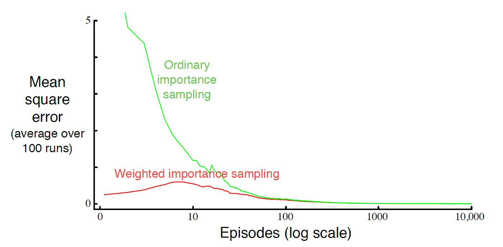


$$
|α \alphaα|$\alpha∣ ∣ | |∣∣\beta$|$\beta∣ ∣ | |∣∣\gamma$|$\gamma∣ ∣ | |∣∣\Gamma$|$\Gamma∣ ∣ | |∣∣\delta$|$\delta∣ ∣ | |∣∣\Delta$|$\Delta∣ ∣ | |∣∣\epsilon$|$\epsilon∣ ∣ | |∣∣\varepsilon$|$\varepsilon∣ ∣ | |∣∣\zeta$|$\zeta∣ ∣ | |∣∣\eta$|$\eta∣ ∣ | |∣∣\theta$|$\theta∣ ∣ | |∣∣\Theta$|$\Theta∣ ∣ | |∣∣\vartheta$|$\vartheta∣ ∣ | |∣∣\iota$|$\iota∣ ∣ | |∣∣\kappa$|$\kappa∣ ∣ | |∣∣\lambda$|$\lambda∣ ∣ | |∣∣\Lambda$|$\Lambda∣ ∣ | |∣∣\mu$|$\mu∣ ∣ | |∣∣\nu$|$\nu∣ ∣ | |∣∣\xi$|$\xi∣ ∣ | |∣∣\Xi$|$\Xi∣ ∣ | |∣∣\pi$|$\pi∣ ∣ | |∣∣\Pi$|$\Pi∣ ∣ | |∣∣\varpi$|$\varpi∣ ∣ | |∣∣\rho$|$\rho∣ ∣ | |∣∣\varrho$|$\varrho∣ ∣ | |∣∣\sigma$|$\sigma∣ ∣ | |∣∣\Sigma$|$\Sigma∣ ∣ | |∣∣\varsigma$|$\varsigma∣ ∣ | |∣∣\tau$|$\tau∣ ∣ | |∣∣\upsilon$|$\upsilon∣ ∣ | |∣∣\Upsilon$|$\Upsilon∣ ∣ | |∣∣\phi$|$\phi∣ ∣ | |∣∣\Phi$|$\Phi∣ ∣ | |∣∣\varphi$|$\varphi∣ ∣ | |∣∣\chi$|$\chi∣ ∣ | |∣∣\psi$|$\psi∣ ∣ | |∣∣\Psi$|$\Psi∣ ∣ | |∣∣\Omega$|$\Omega∣ ∣ | |∣∣\omega$|$\omega$|
$$


### 5.6 incremental Implementation


**weighted importance sampling**

returns 


$$
G_1,G_2,...G_{n-1}
\\all \space staring \space in \space the \space same \space state \space and \space each \space with \space a \space corresponding \space random \space weight \space W_i
\\(e.g. W_i=\rho_{t_i:T(t_i)-1})
\\\rho_{t:T-1}=\frac{\prod_{k=t}^{T-1}\pi(A_k|S_k)p(S_{k+1}|S_k,A_k)}

{\prod_{k=t}^{T-1}b(A_k|S_k)p(S_{k+1}|S_k,A_k)}
=\frac{\prod_{k=t}^{T-1}\pi(A_k|S_k)}{\prod_{k=t}^{T-1}b(A_k|S_k)}


\\ V_n=\frac{\sum_{k=1}^{n-1}W_k G_k}{\sum_{k=1}^{n-1}W_k}

\\ V_{n+1}\leftarrow V_n +\frac{W_n}{C_n}[G_n-V_n] for \space n\ge1
\\ C_{n+1}=C_n+W_{n+1}
\\C_n: for \space each \space state \space cumulative \space sum \space of \space the \space weights \space given \space the \space first \space n \space returns
\\C_0=0( V_i \space is \space arbitrary \space and \space thus \space need \space not \space to \space be \space specified)
$$


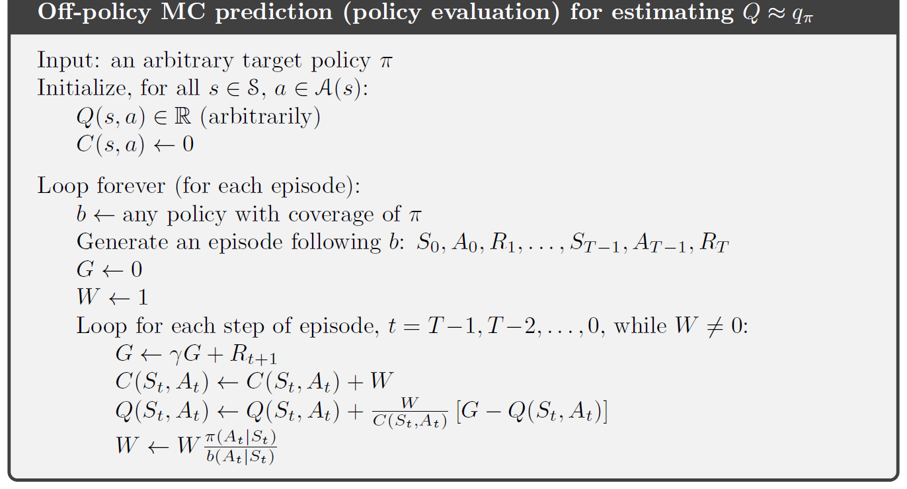


### 5.7 Off-policy Monte Carlo Control


### what' s more

#### **What is the difference between First-Visit Monte-Carlo and Every-Visit Monte-Carlo Policy Evaluation?**


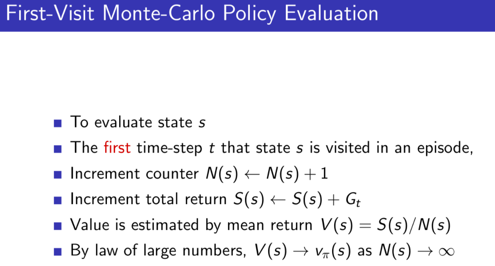


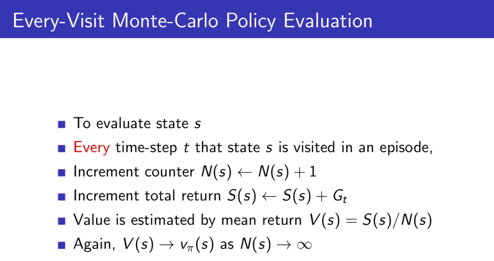


**The first-visit and the every-visit Monte-Carlo** algorithms are both used to solve the **prediction problem**( also called " evaluation problem")

* estimating the value function associated with given fixed (not change during the execution the algorithm) policy. 
* even if we are given the policy, we are not necessarily able to find the exact corresponding value function.

the expected return (expected cumulative future discounted reward), starting from state s (at some time step t) and then following (after time step t) the given policy .


MC: assume that the problem can be naturally split into episodes and each episode proceeds in a discrete number of time steps( from t=0 to t=T)


The return in the case of MC algorithms, is only associated with a single episode( the return of one episode)

the expected return can be different from one episode to the other, bu we will assume that the expected return (of all states) is the same for all episodes.


$$
the \space first-visit \space and \space every-visit \space MC \space algorithms \space are \space used \space to \space estimate \space v_\pi(s) , for \space all \space state \space s\in S.
$$
Obtain some knowledge of the environment in the form of sequences of states , actions and rewards. This knowledge is then used to estimate value function.


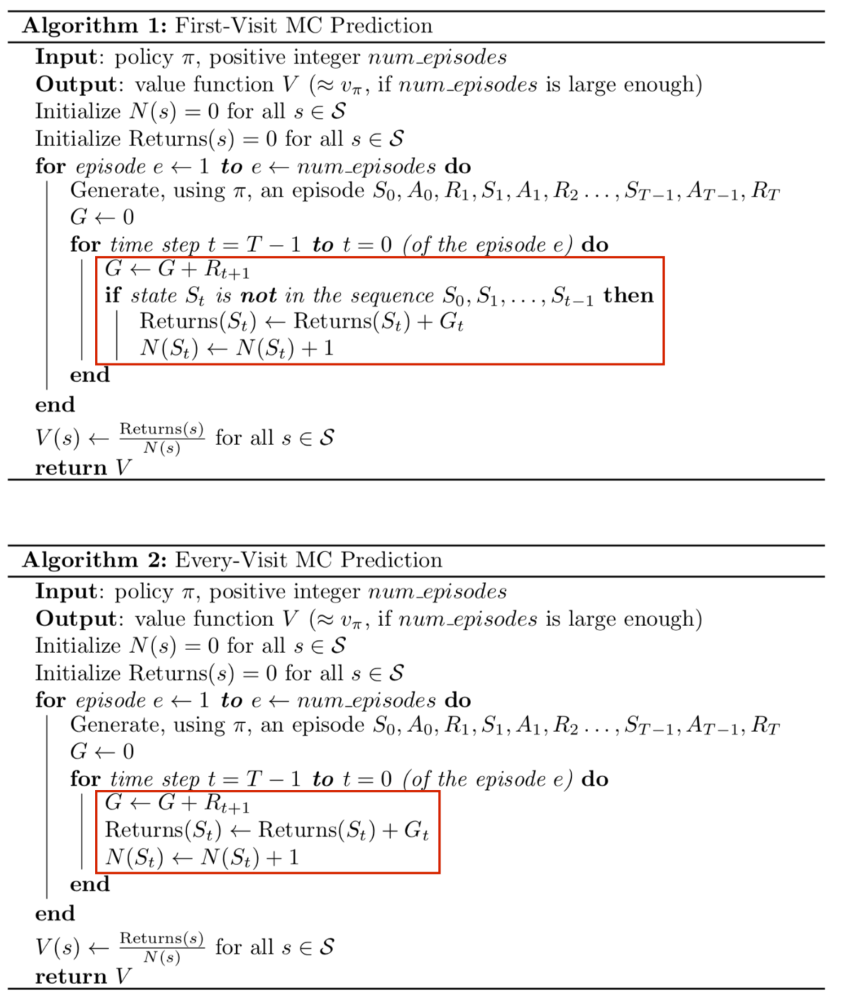


N(s) is a "counter" variable that counts the number of times we visit state s throughout the entire algorithm (i.e. from episode one to num_episodes). Returns(s)Returns(s) is a list of **(un-discounted**) returns for state s.


**the basic idea of both algorithms** is to generate trajectories(of states ,actions and rewards) at each episode, keep track of the returns and number of visits( of each state) and at the end of all episodes, average these returns(for all states)

for first-visit algorithm the red block code will be executed only if it is the first time we encounter S<sub>t</sub> in the sequence of state,actions and rewards.( a certain state s might appear more than once )

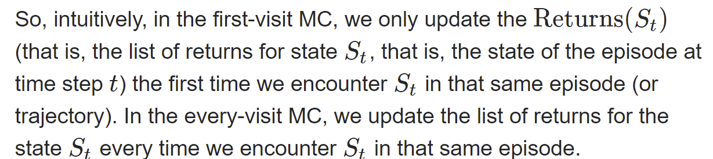


### 5.7 Off-policy Monte Carlo Control

on-policy

* estimate the value of a policy  
* using it for control.

in off-policy the two functions are separated

**behavior policy**: generate behavior

**target policy**: evaluated and improved.

An advantage of this separation 

* the target policy might be deterministic( greedy )
* while the behavior policy can continue to be sample all possible actions


* The behavior policy learns about and improves the target policy.
* To explore all possibilities we require that the behavior policy be soft, so that it select all actions in all states with nonzero probability

* GPI
* weighted importance sampling


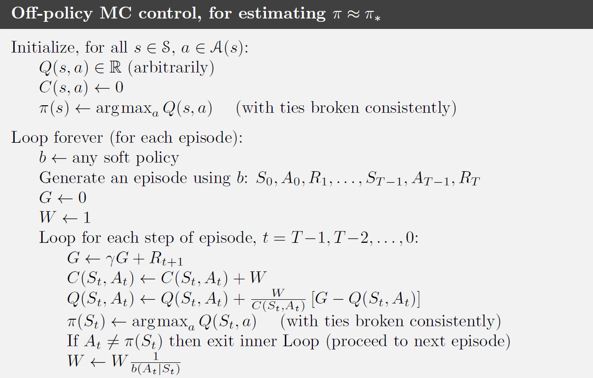


$$
\begin {aligned}
&Initialize, for \space all s \in S, a \in A(s)
\\ &
 \space \space \space \space
Q(s,a) \in R(arbitrarity)
\\&
 \space \space \space \space
C(s,a) \leftarrow 0
\\ &
 \space \space \space \space
\pi(s)\leftarrow argmax_a Q(s,a)(with \space ties \space broken \space consistently)
\\ &
Loop \space forever \space (for \space each \space episode)
\\ &
b\leftarrow any \space soft \space policy
\\&
Generate \space an \space episode \space using \space policy \space b: S_0,A_o,R_1,....S_{T-1},A_{T-1},R_T
\\ & 
\space \space \space \space
G \leftarrow 0
\\ &
 \space \space \space \space
W \leftarrow 0
\\&
 \space \space \space \space
 Loop \space for \space each \space step \space of \space episode, t=T-1,T-2,....0:
 \\&
  \space \space \space \space \space \space \space \space
  G \leftarrow \gamma G+R_{t+1}
\\&
 \space \space \space \space \space \space \space \space
 C(S_t,A_t)\leftarrow C(S_t,A_t)+W
 \\&
  \space \space \space \space \space \space \space \space
  Q(S_t,A_t) \leftarrow Q(S_t,A_t)+\frac{W}{C(S_t,A_t)}|G-Q(S_t,A_t)|
  \\& 
   \space \space \space \space \space \space \space \space
   \pi(S_t)\leftarrow argmax_aQ(S_t,a) (with \space ties \space broken \space consistently)
   \\ &
    \space \space \space \space \space \space \space \space
    if  \space A_t\not= \pi(S_t)
     \space then  \space exit  \space inner  \space Loop(proceed \space to \space next \space episode)
     \\ &
      \space \space \space \space \space \space \space
      W \leftarrow \frac{W}{b(A_t|S_t)}
\end {aligned}
$$
 **potential problem**

* this method only learns from the tails of episodes, when all of the remaining actions in the episode are greedy. 
* If nongreedy actions are common, then learning will be slow, particularly for states appearing in th early portions of long episodes

**way**

* incorporate temporal difference learning


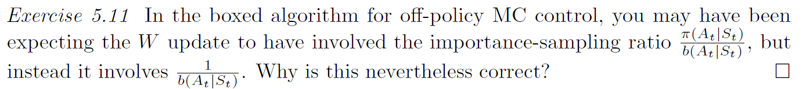


### 5.8 Discounting-aware Importance sampling

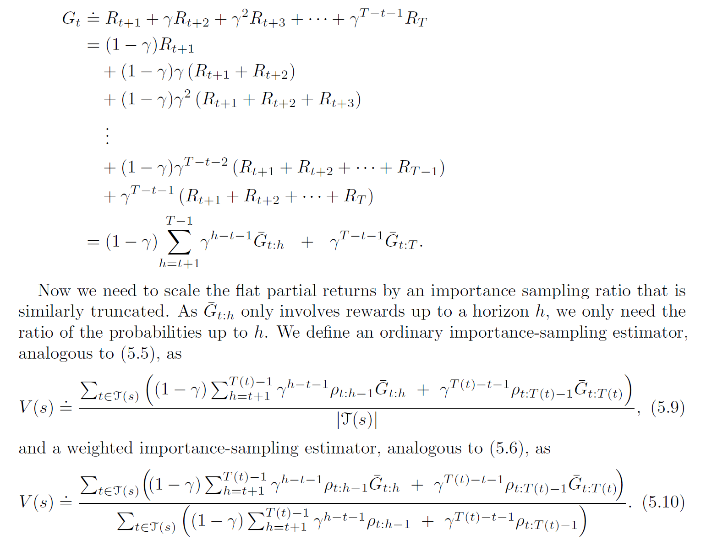

### 5.9 pre-decision Importance Sampling


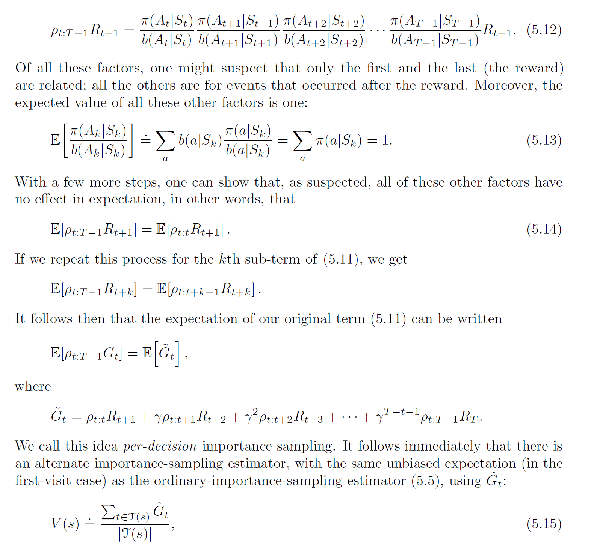


### 5.10 Summary


sample episodes


* learn optimal behavior directly from interaction with the environment, with no model of the environments' dynamics.
* They can be used with simulation or sample models
* It is easy to focus Monte Carlo Methods on a small subset of the states. *A region of special interest can be accurately evaluated without going to the expense of accurately evaluating the rest of the state set*
* They may be less harmed by violations of The Markov property  *do not update their value estimates on the basis of the value estimates of successor state*


# Chapter 6

## Temporal-Difference Leaning


TD leaning:

* a combination of MC ideas and DP ideas
* can learning directly from raw experience without a model of the environment's dynamics


### 6.1 TD Prediction

Both TD and Monte Carlo methods use experience to solve the prediction problem.

Given experience following a policy, both methods update their estimate value function for the non terminal state occurring in that experience


A simple every-visit MC suitable for nonstationary environment
$$
constant-\alpha \space MC
\\
V(S_t)\leftarrow V(S_t)+\alpha[G_t-V(S_t)]
$$


* MC methods must wait until the end of the episode to determine the increment to V(S<sub>t</sub>)

* TD methods need to wait **only** until the next time step. At time t+1 they immediately form a target and make a useful update using the observed reward R<sub>t+1</sub> and V(S<sub>t+1</sub>)

$$
V(S_t)\leftarrow V(S_t)+\alpha(R_t+\gamma V(S_{t+1}-V(S_t)))
$$


TD(0)：one-step TD


$$
Tabular \space for  \space estimating \space v_\pi
\\
\begin {aligned}
& Input: the \space policy \space \pi \space to \space to \space be \space evaluated
\\&
step \space size \space \alpha \in(0,1]
\\&
Initialize \space V(s), for \space all \space s \in S^+,arbitrarily \space except \space that \space V(terminal)=0
\\&
Loop \space for \space each \space episode:
\\&  \space \space \space \space
Initialize \space S
\\&  \space \space  \space   \space 
Loop  \space for  \space each  \space step  \space of  \space episode:
\\&
  \space   \space   \space   \space   \space   \space   \space   \space 
  A \leftarrow action  \space given  \space by  \space \pi  \space for  \space S
\\&
  \space   \space   \space   \space   \space   \space   \space   \space 
  Taken   \space action  \space A,observe  \space R,S'
\\&
  \space   \space   \space   \space   \space   \space   \space   \space 
  V(S) \leftarrow V(S)+\alpha[R+\gamma V(S')-V(S)]
  \\&
    \space   \space   \space   \space   \space   \space   \space   \space 
    S \leftarrow S'
\\& 
  \space   \space   \space   \space 
Until  \space S  \space is  \space terminal

\end{aligned}
$$
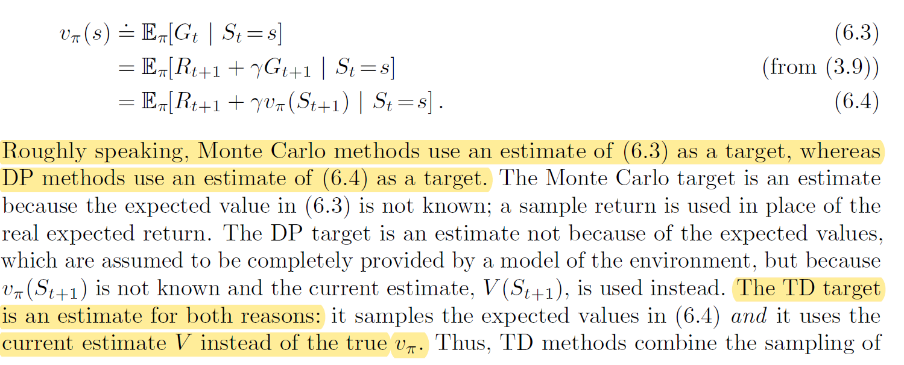


The value estimate for the state node at the top of backup diagram is updated on the basis of the one sample transition from it to the immediately following state.


$$
TD \space error:
\\
\delta_t=R_{t+1}+\gamma V(S_{t+1})-V(S_t)
$$


Monte Carlo error can be written as  a sum of TD errors


$$
\begin {aligned}
G_t-V(S_t)
&=R_{t+1}+\gamma G_{t+1}-V(S_t)+\gamma V(S_{t+1})- \gamma V(S_{t+1})
\\
&=\delta_t+\gamma(G_{t+1}-V(S_{t+1}))
\\
&=\delta_t+\gamma \delta_t+...
\\
&=\sum_{k=t}^{T-1}\gamma^{k-t}\delta_k
\end {aligned}
$$


**The identity is not exact if V is updated during the episode, but if the step size is small then it may still hold approximately**


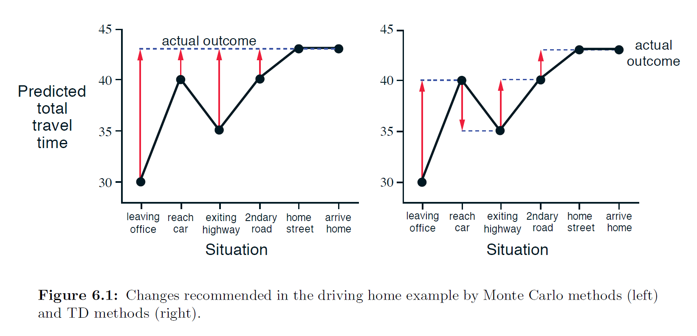


### 6.2 Advantages of TD Prediction Methods


$$
Prob(T>k)
任何两行（label，k个bit）都是不同
<=
存在至少两行（label，k个bit）是相同的
$$


$$
the probability of one bit is the same as the other bit
\\ \frac{1}{3}^2+\frac{2}{3}^2
\\
the probability of k bits are the totally same as the other k bits:
\\ (\frac{1}{3}^2+\frac{2}{3}^2)^k
\\
select 2 rows from n rows.
\\ C_n^2
\\ the probability of there is at least 2 rows are totally same where the 2 rows are selected from n rows.
\\ C_n^2 * (\frac{1}{3}^2+\frac{2}{3}^2)^k
\\ the probability of there is at least i rows are totally same where the i rows are selected from n rows.
\le the probability of there is at least i+1 rows are totally same where the i+1 rows are selected from n rows.
\\
0:1/3
\\1:2/3


\\0: 1/6
\\1:2/6
\\2:3/6

\\A_{i} represent the i-th row is only completely the same as it self: P(T>k)

\\A_{ij} \space  repressent \space the i-th row is completely the same as j-th row.


\\

\\A_{ijk} \space  repressent \space the i-th row is completely the same as j-th row and k-th row.
$$

$$
C_n^2 * \frac{5}{9}^k  \rightarrow 0
\\k=?
\\ \frac{3+\theta}{4}log_{\frac{1}{p_1^2+p_2^2}}n
=\frac{\frac{3+\theta}{4}log_2n}{log_2(\frac{1}{p_1^2+p_2^2})}

\\ \theta=5

\\\frac{3+\theta}{4}log_{\frac{1}{p_1^2+p_2^2}} n=2log_{\frac{1}{p_1^2+p_2^2}}n

\begin{aligned}
\end{aligned}
$$

$$
\begin {aligned}
C_n^2* [p_1^2+p_2^2]^k
&=C_n^2* [p_1^2+p_2^2]^{\frac{3+\theta}{4}log_{\frac{1}{p_1^2+p_2^2}}n}
\\&=C_n^2* n^{-\frac{3+\theta}{4}}
\\&=\frac{n(n-1)}{2}*n^{-\frac{3+\theta}{4}}
=limit_{n\rightarrow \infty}\frac{n(n-1)}{2}*n^{-\frac{3+\theta}{4}}
\\&=
limit_{n\rightarrow \infty} \frac{1}{2}n^{2-\frac{3+\theta}{4}}  \space \space(\theta=5+4\delta,\delta>0)
\\ 
&=limit_{n\rightarrow \infty} \frac{1}{2}n^{-\delta} 
\\&=0

\end{aligned}


\\
k=-\frac{(2+\delta)log_2 n}{log_2(p_1^2+p_2^2)}
$$


\ge:  great equal

$$
\begin {aligned}
|P(k)-U| 
& \le Prob(T \ge k)
\\& \le \sum_{1 \le i < j \le n} Prob(A_{ij}) 
\\ &= C_n^2 [p_1^2+p_2^2]^k

\\ now \space we \space let \space k=- \frac{(2+\delta)log_2 n}{log_2 (p_1^2+p_2^2)}
\\
\\
|P(k)-U| & \le C_n^2 [p_1^2+p_2^2]^{- \frac{(2+\delta)log_2 n}{log_2 (p_1^2+p_2^2)}}
\\ &=C_n^2 [p_1^2+p_2^2]^{-(2+\delta)log_{p_1^2+p1^2}n}
\\ &= C_n^2 n^{-(2+\delta)}
\\&=\frac{n(n-1)}{2}n^{-(2+\delta)}
\\&=^{n \rightarrow \infty} n^{-\delta}=0

\end {aligned}
$$


123

231

321

312

第一列：

1：1===1/4-1/3

2：1==1/4-1/3

3：2==2/4-1/3

第二列：

2：2==2/4

3：1

1：1

第三列

3：1

1：2

2：1


# Markdown 文档数学公式集合_Martian-CSDN 博客


正文 (inline) 中的 LaTeX 公式用 $…$ 定义，单独一行用 $. . . . ........$ 定义


**1. 上下标**
^ 表示上标，如果是多个字符，请使用 {}，_表示下标，如果是多个字符，请使用 ()


```
$$ f(x) = x_i + y^x，f((x+y)^{u}) = (x+y)^{u+v}$$
```


f (x) = x i + y x ， f ( ( x + y ) u ) = ( x + y ) u + v f(x) = x_i + y^x，f((x+y)^{u}) = (x+y)^{u+v}*f*(*x*)=*x**i*+*y**x*，*f*((*x*+*y*)*u*)=(*x*+*y*)*u*+*v*


**2. 开方**
sqrt 表示开方


```
$\sqrt[m]{n}$ # 表示对n开m次方
$$\sqrt{25}$$
$$\sqrt[3]{25}$$
```


25 ， 25 3 \sqrt{25}， \sqrt[3]{25}25，325


**3. 省略号**
\ldots 表示语文本底线对其的省略号，\cdots 表示与文本中线对其的省略号，\cdot 表示一个点，也就是点乘号


```
这里是省略号$\ldots$，底线对齐
这里是省略号$\cdots$，中线对齐
$$ f(x_1,x_2,\ldots,x_n) = x_1^2 +x_2^2+\cdots+x_n^2 $$
```


这里是省略号… \ldots…，底线对齐
这里是省略号⋯ \cdots⋯，中线对齐
f ( x 1 , x 2 , … , x n ) = x 1 2 + x 2 2 + ⋯ + x n 2 f(x_1,x_2,\ldots,x_n) = x_1^2 +x_2^2+\cdots+x_n^2*f*(*x*1​,*x*2​,…,*x**n*​)=*x*12​+*x*22​+⋯+*x**n*2​


**4. 括号**
(), [] 直接写即可，{} 需要转义


```
这是小括号$()$
这是小括号$[]$
这是小括号$\{\}$
```


( ) , [ ] , { } (), [], \{\}(),[],{}


**5. 分号**
使用 \frac{分子}{分母}，或者使用 分子 \over 分母


```
$$\frac{a+b}{c+d}$$
```


a + b c + d \frac{a+b}{c+d}*c*+*d**a*+*b*,n + m m ⋅ n {n+m} \over {m\cdot n}*m*⋅*n**n*+*m*


**6. 向量**


```
\vec a \cdot \vec b = 0
```


a ⃗ ⋅ b ⃗ = 0 \vec a \cdot \vec b = 0*a*⋅*b*=0


**7. 箭头**


| 示例 | 代码                | 示例 | 代码                |
| ---- | ------------------- | ---- | ------------------- |
| ←    | \leftarrow          | ⇐    | \Leftarrow          |
| →    | \rightarrow         | ⇒    | \Rightarrow         |
| ↔    | \leftrightarrow     | ⇔    | \Leftrightarrow     |
| ⟵    | \longleftarrow      | ⟸    | \Longleftarrow      |
| ⟶    | \longrightarrow     | ⟹    | \Longrightarrow     |
| ⟷    | \longleftrightarrow | ⟺    | \Longleftrightarrow |
| ↑    | \uparrow            | ↓    | \downarrow          |
| ↕    | \updownarrow        |      |                     |


**8. 求和, 求积**


```
$$\sum_{i=1}^{n} x_i$$
$$\prod_{i=0}^n{1 \over {x^2}}$$
```


∑ i = 1 n x i , ∏ i = 0 n 1 x 2 \sum_{i=1}^{n} x_i, \prod_{i=0}^n{1 \over {x^2}}*i*=1∑*n**x**i*,*i*=0∏*n**x*21


**9. 积分**


```
$$\int_0^\infty{f(x)dx}$$
```


∫ 0 ∞ f (x) d x \int_0^\infty{f(x)dx}∫0∞*f*(*x*)*d**x*


**10. 方程式**


```
$$\begin{cases}
a_1x+b_1y+c_1z=d_1\\
a_2x+b_2y+c_2z=d_2\\
a_3x+b_3y+c_3z=d_3\\
\end{cases}
$$
```


{ a 1 x + b 1 y + c 1 z = d 1 a 2 x + b 2 y + c 2 z = d 2 a 3 x + b 3 y + c 3 z = d 3

⎧⎩⎨a1x+b1y+c1z=d1a2x+b2y+c2z=d2a3x+b3y+c3z=d3{a1x+b1y+c1z=d1a2x+b2y+c2z=d2a3x+b3y+c3z=d3


⎩⎪⎨⎪⎧a1x+b1y+c1z=d1a2x+b2y+c2z=d2a3x+b3y+c3z=d3


**11. 矩阵**


```
$$\begin{bmatrix}
{a_{11}}&{a_{12}}&{\cdots}&{a_{1n}}\\
{a_{21}}&{a_{22}}&{\cdots}&{a_{2n}}\\
{\vdots}&{\vdots}&{\ddots}&{\vdots}\\
{a_{m1}}&{a_{m2}}&{\cdots}&{a_{mn}}\\
\end{bmatrix}$$
```


[ a 11 a 12 ⋯ a 1 n a 21 a 22 ⋯ a 2 n ⋮ ⋮ ⋱ ⋮ a m 1 a m 2 ⋯ a m n ]

⎡⎣⎢⎢⎢⎢⎢a11a21⋮am1amp;a12amp;a22amp;⋮amp;am2amp;⋯amp;⋯amp;⋱amp;⋯amp;a1namp;a2namp;⋮amp;amn⎤⎦⎥⎥⎥⎥⎥[a11amp;a12amp;⋯amp;a1na21amp;a22amp;⋯amp;a2n⋮amp;⋮amp;⋱amp;⋮am1amp;am2amp;⋯amp;amn]


⎣⎢⎢⎢⎡a11a21⋮am1a12a22⋮am2⋯⋯⋱⋯a1na2n⋮amn⎦⎥⎥⎥⎤


**12. 希腊字符**


| 字符 | 表达式   | 字符 | 表达式 |
| ---- | -------- | ---- | ------ |
| α    | \alpha   | β    | \beta  |
| γ    | \gamma   | δ    | \delta |
| ε    | \epsilon | ζ    | \zeta  |
| η    | \eta     | θ    | \theta |
| ι    | \iota    | κ    | \kappa |
| λ    | \lambda  | μ    | \mu    |
| ν    | \nu      | ξ    | \xi    |
| π    | \pi      | ρ    | \rho   |
| σ    | \sigma   | τ    | \tau   |
| υ    | \upsilon | φ    | \phi   |
| χ    | \chi     | ψ    | \psi   |
| ω    | \omega   |      |        |


**13. 连线**


```
\overline{a+b+c+d}

\underline{a+b+c+d}

\overbrace{a+\underbrace{b+c}_{1.0}+d}^{2.0}

\hat{y} \check{y} \breve{y}
```


a + b + c + d ‾ , a + b + c + d ‾ , a + b + c ⎵ 1.0 + d ⏞ 2.0 , y ^ y ˇ y ˘ \overline{a+b+c+d} , \underline{a+b+c+d}, \overbrace{a+\underbrace{b+c}_{1.0}+d}^{2.0} , \hat{y} \check{y} \breve{y}*a*+*b*+*c*+*d*,*a*+*b*+*c*+*d*,*a*+1.0*b*+*c*+*d*2.0,*y*^*y*ˇ*y*˘


**14. 集合运算符号**


```
\emptyset \in \notin \subset \supset \subseteq \supseteq \bigcap \bigcup \bigvee \bigwedge \biguplus \bigsqcup
```


∅ ∈ ∉ ⊂ ⊃ ⊆ ⊇ ⋂ ⋃ ⋁ ⋀ ⨄ ⨆ \emptyset \in \notin \subset \supset \subseteq \supseteq \bigcap \bigcup \bigvee \bigwedge \biguplus \bigsqcup∅∈∈/⊂⊃⊆⊇⋂⋃⋁⋀⨄⨆


**15. 算术运算符号**


```
\pm \times \div \mid
```


± × ÷ ∣ \pm \times \div \mid±×÷∣


**16. 极限符号**


```
$$\lim_{n\rightarrow+\infty}\frac{1}{n(n+1)}$$
```


lim ⁡ n → + ∞ 1 n ( n + 1 ) \lim_{n\rightarrow+\infty}\frac{1}{n(n+1)}*n*→+∞lim*n*(*n*+1)1


**17. 对数函数符号**


| 示例   | 代码      |
| ------ | --------- |
| ln15   | \ln15     |
| log210 | \log_2 10 |
| lg7    | \lg7      |


**18. 三角函数符号**


| 示例 | 代码     |
| ---- | -------- |
| sin  | \sin     |
| cos  | \cos     |
| cot  | \cot     |
| tan  | \tan     |
| csc  | \csc     |
| sec  | \sec     |
| 30∘  | 30^\circ |


**19. 逻辑运算符**


| 代码        | 示例            |
| ----------- | --------------- |
| \because    | ∵               |
| \therefore  | ∴               |
| \forall     | ∀               |
| \not=       | ≠               |
| \exists     | ∃               |
| \not>       | ̸ &gt; \not&gt;̸> |
| \not\subset | ⊄               |

$$
\begin{aligned}
a  &= b^2 + c^2\\
&= w^3 + b
\end{aligned}
$$


